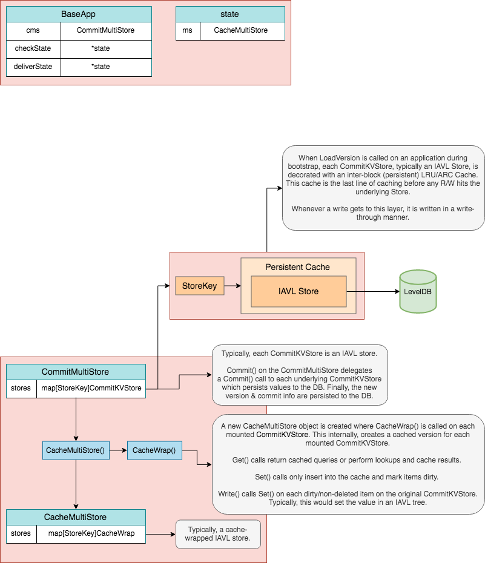
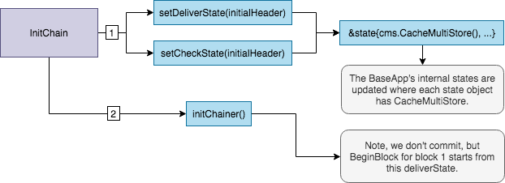

> Cosmos-SDK官方文档:
> https://github.com/cosmos/cosmos-sdk/tree/master/docs


# Cosmos-SDK 笔记


## Cosmos-SDK 的架构

> https://github.com/cosmos/cosmos-sdk/blob/master/docs/intro/sdk-app-architecture.md


区块链核心就是一个 Replicated Deterministic State Machine (可复制的确定性状态机)

### Tendermint

Tendermint 是一个与应用程序(区块链)无关的网络共识引擎, 基于拜占庭容错算法(Byzantine-Fault-Tolerant, BFT)并使用相同的交易顺序实现共识. 

Tendermint 框架中参与共识的节点成为 *Validators* (验证节点).验证者们负责选举下一个区块的提议者(proposer),并对提议者产生的新的区块进行验证和[投票, 如果投票数超过`2/3`的验证者数, 则区块是有效的,反之此次提议的区块无效,进行下一轮提议和投票, 这一轮提议和投票分为 `provote`  和  [`promcommit`](https://docs.tendermint.com/master/spec/consensus/consensus.html#precommit-step-height-h-round-r) 两个阶段. 当一个区块通过验证者验证之后, 那么就意味着此区块包含的交易都是有效的, 状态机就会进行更改, 同时更换下一个区块的提议者.


```
                ^  +-------------------------------+  ^
                |  |                               |  |   Built with Cosmos SDK
                |  |  State-machine = Application  |  |
                |  |                               |  v
                |  +-------------------------------+
                |  |                               |  ^
Blockchain node |  |           Consensus           |  |
                |  |                               |  |
                |  +-------------------------------+  |   Tendermint Core
                |  |                               |  |
                |  |           Networking          |  |
                |  |                               |  |
                v  +-------------------------------+  v
```


#### ABCI

ABCI (Application Blockchain  Interface)

Tendermint 只会处理交易字节(transaction bytes), 它不知道交易的具体内容是什么.所有的Tendermint节点处理的交易字节顺序都是确定的. Tendermint和应用程序通过ABCI进行数据交互, Tendermint通过ABCI将交易字节发给应用程序,只需知道返回的返回码是成功的还是失败的.

```
              +---------------------+
              |                     |
              |     Application     |
              |                     |
              +--------+---+--------+
                       ^   |
                       |   | ABCI
                       |   v
              +--------+---+--------+
              |                     |
              |                     |
              |     Tendermint      |
              |                     |
              |                     |
              +---------------------+
```

以下是几个重要的ABCI消息:

- `CheckTx`: 当Tendermint Core 接收到一笔交易, 这笔交易会被传递给*应用程序* 去检查交易的是否符合基本要求. `CheckTx`是用来保护全节点的交易池(mempool)抵抗垃圾交易攻击. 在CosmosSDK中有一个特殊的handler被称为[`AnteHandler`](https://github.com/cosmos/cosmos-sdk/blob/master/docs/basics/gas-fees.md#antehandler)用来执行一系列的交易检查操作, 例如检查交易费的有效性,交易签名的有效性. 如果检查通过, 这笔交易将被加入到交易池(mempool)然后通过p2p转发到其他节点. 注意:经过`CheckTx`,这些交易还没有被执行(尚未修改任何状态), 因为这些交易还没有被打包进区块中.

- `DeliverTx`: 当Tendermint Core 接收到一个有效的区块, 区块中的每个交易都通过`DeliverTx`*有序*地传递给应用程序执行. 在这个阶段状态机会发生改变. `AnteHandler` 与事务中的每个消息的实际处理程序一起再次执行.

- `BeginBlock/EndBlock` : 不管区块中是否包含交易, 在区块的开始和结束时这两个消息都会被执行. 这对于跟踪执行逻辑很有用. 但是需要谨慎，因为计算量大的循环可能拖慢区块链, 甚至无限循环会导致区块链停止。


## CosmosSDK 设计 - Cosmos SDK 主要组件

> https://github.com/cosmos/cosmos-sdk/blob/master/docs/intro/sdk-design.md

CosmosSDK是建立在Tendermint之上可以用来可开发安全的状态机的框架. Cosmos使用Golang实现ABCI. 拥有一个 `multistore` 进行数据持久化, `router`进行交易处理.


以下是一个简单的概述, 描述了一个基于CosmosSDK构建的应用程序是如何处理来自Tendermint通过`DeliverTx`发来的交易:

- 1. 解码(Decode)接受到的来自Tendermint共识引擎的`transactions`(记住Tendermint仅仅只处理交易字节 `[]byte` 不关心交易内容).
- 2. 提取(Extract) `transactions`中的 `messages`并且做一些基本的有效性检查.
- 3. 路由(Route)每个消息到相应的模块(module)进行消息处理.
- 4. 提交(Commit)状态的修改(state changes).


### 简介`baseapp`


`baseapp` 是Cosmos SDK应用程序的一个样板实现.它带有一个用于处理和地层共识引擎的连接的ABCI实现. 通常, 一个Cosmos SDK应用程序会扩展 `baseapp`, 通过在`app.go`嵌入 `baseapp`.  这是一个来自Cosmos SDK教程中实际的例子:  https://github.com/cosmos/sdk-tutorials/blob/c6754a1e313eb1ed973c5c91dcc606f2fd288811/app.go#L72-L92

```go
type nameServiceApp struct {
	*bam.BaseApp           // 嵌入的 baseapp
	cdc *codec.Codec

	// keys to access the substores
	keys  map[string]*sdk.KVStoreKey
	tkeys map[string]*sdk.TransientStoreKey

	// Keepers
	accountKeeper  auth.AccountKeeper
	bankKeeper     bank.Keeper
	stakingKeeper  staking.Keeper
	slashingKeeper slashing.Keeper
	distrKeeper    distr.Keeper
	supplyKeeper   supply.Keeper
	paramsKeeper   params.Keeper
	nsKeeper       nameservice.Keeper

	// Module Manager
	mm *module.Manager
}
```

`baseapp`的目标是在*存储(store)* 和 *可扩展的状态机(extensible state machine)* 提供一个安全的接口, 同时在ABCI保持不变的情况下尽可能地少定义状态机.

更多关于 `baseapp`, 可看[这里](https://github.com/cosmos/cosmos-sdk/blob/master/docs/core/baseapp.md)


### `Multistore`

Cosmos SDK 提供了一个名为 `multistore`组件用于状态的持久化(persisting state). `multistore`允许开发者声明任意数量的`KVStores`. 这些`KVStores`只能接收 `[]byte`类型作为值, 因此开发自定义的结构体在存储前需要使用一个[`codec`进行序列化](https://github.com/cosmos/cosmos-sdk/blob/master/docs/core/encoding.md). 

抽象`multistore`用于将不同模块的状态分开, 不同的模块只需要维护自己的状态 .关于`multisotre`更多的详情, [点击这里](https://github.com/cosmos/cosmos-sdk/blob/master/docs/core/store.md#multistore)


### Modules

Cosmos SDK 强大之处在于它的模块化. 应用程序使用一些SDK的*可互相操作*(interoperate)的模块集合进行构建. 每个模块定义了一个状态子集并且包含了模块自己的`message/transaction`处理器(processor), 而SDK负责将每个消息(message)路由到它们各自的模块.


以下是继续Cosmos SDK构建的应用程序的全节点收到一个有效区块后处理一笔交易的大致流程:

```
                                      +
                                      |
                                      |  Transaction relayed from the full-node's Tendermint engine
                                      |  to the node's application via DeliverTx
                                      |  
                                      |
                                      |
                +---------------------v--------------------------+
                |                 APPLICATION                    |
                |                                                |
                |     Using baseapp's methods: Decode the Tx,    |
                |     extract and route the message(s)           |
                |                                                |
                +---------------------+--------------------------+
                                      |
                                      |
                                      |
                                      +---------------------------+
                                                                  |
                                                                  |
                                                                  |
                                                                  |  Message routed to the correct
                                                                  |  module to be processed
                                                                  |
                                                                  |
+----------------+  +---------------+  +----------------+  +------v----------+
|                |  |               |  |                |  |                 |
|  AUTH MODULE   |  |  BANK MODULE  |  | STAKING MODULE |  |   GOV MODULE    |
|                |  |               |  |                |  |                 |
|                |  |               |  |                |  | Handles message,|
|                |  |               |  |                |  | Updates state   |
|                |  |               |  |                |  |                 |
+----------------+  +---------------+  +----------------+  +------+----------+
                                                                  |
                                                                  |
                                                                  |
                                                                  |
                                       +--------------------------+
                                       |
                                       | Return result to Tendermint
                                       | (0=Ok, 1=Err)
                                       v
```

每个module都可以被看作是一个小的状态机. 开发者需要定义模块处理的状态子集(subset of state), 还要自定义修改状态的消息(message)类型(注意: `message`是通过`baseapp`从`transactions`提取出来的). 通常, 每个模块在`multistore`定义它自己的`KVStore`来存储这些模块定义的状态子集. 大多数开发者在构建自己的模块时需要访问其他第三方的模块. 鉴于Cosmos-SDK是一个开放框架,某些模块可能是恶意的,这意味着需要安全原则来规范模块间的交互. 这个原则基于[object-capabilities](https://github.com/cosmos/cosmos-sdk/blob/master/docs/core/ocap.md). 实际上, 并不是说着要为其他模块保存一个访问控制列表, 而是每个模块实现了一个名为`keepers`的特殊对象(speicial objects), `keepers`可以被传递给其他模块以赋予其一组预定义(pre-defined)的功能.


SDK 的模块定义在 `x/` 目录下, 以下是几个核心的模块:

- `x/auth` : 用于管理账户和签名
- `x/bank` : 用于激活代币和代币转账
- `x/staking` + `x/slashing`: 用于构建权益证明`POS`(Proof-Of-Stake)区块链

 除了可以使用`x/`目录中已经存在的模块之外 , SDK还允许你构建自己的模块用于自己的应用程序中.


## Cosmos SDK 核心组件剖析

### Node Client

守护进程或者说全节点, 是基于SDK的区块链的核心进程. 全节点进程用于初始化状态机,连接其他全节点并在一个接收到一个新的区块时更新状态机.

```
                ^  +-------------------------------+  ^
                |  |                               |  |
                |  |  State-machine = Application  |  |
                |  |                               |  |   Built with Cosmos SDK
                |  |            ^      +           |  |
                |  +----------- | ABCI | ----------+  v
                |  |            +      v           |  ^
                |  |                               |  |
Blockchain Node |  |           Consensus           |  |
                |  |                               |  |
                |  +-------------------------------+  |   Tendermint Core
                |  |                               |  |
                |  |           Networking          |  |
                |  |                               |  |
                v  +-------------------------------+  v
```

区块链全节点是可执行文件, 通常以 `d`(daemon)结尾. 这个可执行文件通过编译位于`./cmd/appd/`目录下的`main.go`得到. 这个操作一般写在 Makefile里面.

一旦主的可执行文件被构建, 就可以通过 `start` 命令进行启动.这个命令的主要作用是做以下3件事情:

- 1. 创建一个在`app.go`中的定义的状态机实例.
- 2. 使用最新的已知的状态初始化状态机, 从存储在`~/.appd/data`目录提取`db`. 此时, 状态机的高度是 `appBlockHeight`.
- 3. 创建并启动一个新的Tendermint实例. 除其他事项外, 节点会执行与对端节点(peers)的握手, 从其他节点获取最新的区块高度 `blockHeight`, 如果最新区块大于本地的最高区块高度`appBlockHeight`, 那么,节点会重放区块(replay blocks)以同步到最新区块高度. 如果`appBlockHeight`是`0`, 那么节点会从创始区块开始启动, 并且Tendermint会通过ABCI发送一个`InitChain`消息给应用程序`app`, 它会触发 `InitChainer`.


### Core Application File

一般状态机的核心定义在一个名为`app.go`的文件中.它主要包含了应用程序的类型定义以及创建,初始化的一些函数.

#### 应用程序的类型定义


- **`baseapp`的引用(指针)**: 在`app.go`中定义的应用是`baseapp`的一个扩展(子类). 当一个交易被Tendermint中继到应用程序时, `app`会使用`baseapp`的方法路由到对应的模块. `baseapp`实现了应用程序的大部分核心逻辑, 包括所有的ABCI方法和路由逻辑(routing logic).

- **一组key stores**: `store`包含了完整的状态, 在Cosmos SDK 是以`multistore`( a store of stores ) 实现的. 每个模块使用一个或多个`multisotre`中的`stores`保存各自模块中的状态. 这些`stores`可以通过声明在`app`类型中的key进行访问. 这些 key和 `keepers` 是Cosmos SDK的 `object-capabilities`(对象能力)模型的核心.

- **一组模块的`keeper`**:  每个模块定义了一个名为`keeper`抽象, 用于处理模块的store(s)的读和写. 一个模块的`keeper`的方法可以被其他模块调用(如果被授权), 之所以要把他们定义在应用程序类型中, 并且导出为interface给其他模块, 是为了其他模块能够访问这些已授权方法.

- **一个`appCodec`的引用(指针)** : `appCodec`是用于对数据结构进行序列化和反序列化以便进行存储, 因为stores只能使用`[]byte`进行存储.默认的codec是 Protocol Buffers.

- **一个`legacyAmino` 的引用(指针) codec**: SDK的某些部分尚未迁移至上述`appCodec`, 依然使用使用Amino进行硬编码. 其他部分也显示的使用Amino以保持向后兼容.基于这些原因, 应用程序依然持有一个传统的Amino解码器(codec). 但是请注意 Amino codec将在将来的发行版中移除.


- **一个moudle manager的引用和一个 basic moudle manager**:  模块管理器(moudle manager)是一个包含一组应用程序模块的对象. 它用于对模块进行一些操作, 如 注册路由(registering `routes`), gRPC 查询服务和Tendermint基本查询路由 或者设置不同模块之间的函数执行顺序,如`InitChainer`, `BeginBlocker`和`EndBlocker`.


如下`simapp` [是SDK自己的用于测试的demo](https://github.com/cosmos/cosmos-sdk/blob/d9175200920e96bfa4182b5c8bc46d91b17a28a1/simapp/app.go#L140-L179)

```go

// SimApp extends an ABCI application, but with most of its parameters exported.
// They are exported for convenience in creating helper functions, as object
// capabilities aren't needed for testing.
type SimApp struct {
	*baseapp.BaseApp
	cdc               *codec.LegacyAmino
	appCodec          codec.Marshaler
	interfaceRegistry types.InterfaceRegistry

	invCheckPeriod uint

	// keys to access the substores
	keys    map[string]*sdk.KVStoreKey
	tkeys   map[string]*sdk.TransientStoreKey
	memKeys map[string]*sdk.MemoryStoreKey

	// keepers
	AccountKeeper    authkeeper.AccountKeeper
	BankKeeper       bankkeeper.Keeper
	CapabilityKeeper *capabilitykeeper.Keeper
	StakingKeeper    stakingkeeper.Keeper
	SlashingKeeper   slashingkeeper.Keeper
	MintKeeper       mintkeeper.Keeper
	DistrKeeper      distrkeeper.Keeper
	GovKeeper        govkeeper.Keeper
	CrisisKeeper     crisiskeeper.Keeper
	UpgradeKeeper    upgradekeeper.Keeper
	ParamsKeeper     paramskeeper.Keeper
	IBCKeeper        *ibckeeper.Keeper // IBC Keeper must be a pointer in the app, so we can SetRouter on it correctly
	EvidenceKeeper   evidencekeeper.Keeper
	TransferKeeper   ibctransferkeeper.Keeper

	// make scoped keepers public for test purposes
	ScopedIBCKeeper      capabilitykeeper.ScopedKeeper
	ScopedTransferKeeper capabilitykeeper.ScopedKeeper
	ScopedIBCMockKeeper  capabilitykeeper.ScopedKeeper

	// the module manager
	mm *module.Manager

	// simulation manager
	sm *module.SimulationManager
}
```


#### 构造者函数(Constructor Function)

这个函数用于构造一个新的如上节所定义的`Application`实例, 必须符合 `AppCreator`函数签名, 以便在 `start`命令中使用.


```go

// AppCreator is a function that allows us to lazily initialize an
// application using various configurations.
AppCreator func(log.Logger, dbm.DB, io.Writer, AppOptions) Application

```

以下是构造者函数的主要执行的操作:


- 实例化一个新的`codec`并且使用`basic manager`初始化应用程序每个模块的`codec`
- 实例化一个新的应用程序对象, 其包含`baseapp`引用的和一个`codec`和其他的相应的store keys.
- 使用应用程序的每个模块的`NewKeeper`函数实例化所有的在应用程序类型中定义的`keeper`. 注意: `keepers`必须以正确的顺序进行实例化, 因为一个模块的`NewKeeper`可能需要引用其他模块的`keeper`.
- 使用应用程序的每个模块的`AppModule`对象实例化应用程序的 `module manager`.
- 使用 `module manager`初始化应用程序的 `routes`, `gRPC query serives` 和 `legacy query routes`. 当一个交易经由Tendermint通过ABCI发送给应用程序时, 使用`routes`将交易路由到相应模块的`handler`. 同样地, 当一个应用程序受到一个gRPC请求时, 会路由到相应的`gRPC query service`. SDK依然支持传统的Tendermint查询, 这些查询都是通过`legacy query routes`进行路由.

- 使用`module manager`注册应用程序模块的的不变量(application's modules' invariants). 例如, token总发行量. 它会在每个区块中进行检查. 检查不变量的操作是通过一个名为 `InvariantRegistry`的模块进行. 不变量的值应该等于模块中定义的值.如果该值与预测的值不同,那么在不变量注册表中定义的操作将本触发(一般表现为区块链挂掉). 早日发现问题, 这对于确保不会发现任何严重错误并产生难以修复的长期影响非常有用.
- 使用`module manager` 设置应用程序的每个模块的 `InitGenesis`, `BeginBlocker` 和`EndBlocker`的执行顺序. 注意并不是所有的模块都实现了这些函数.
- 设置应用程序其他的参数:
  - `InitChianer`: 被用于第一次启动时初始化应用程序
  - `BeginBlocker`, `EndBlocker`: 在开始区块和结束区块是被调用
  - `anteHandler`: 被用于处理验证手续费和签名有效性

- 挂载 stores
- 返回应用程序实例

注意:这个函数仅创建了一个应用实例, 而实际的状态将从 `~/.appd/data`目录中加载, 如果是第一次启动, 则从创始文件(`genesis file`)生成.


可以看`simapp`示例代码: https://github.com/cosmos/cosmos-sdk/blob/d9175200920e96bfa4182b5c8bc46d91b17a28a1/simapp/app.go#L190-L427


#### InitChainer

`InitChainer`是从创世文件(即创世账号(genesis accounts)的余额)初始化应用程序状态的函数. 当节点从高度0开始启动时(`appBlockHeight == 0`), 应用程序收到来自Tendermint的`InitChain`消息时会调用此函数. 应用程序必须在它的构造函数(constructor)中通过`SetInitChainer`方法设置 `InitChainer`.

通常, `InitChainer`主要是由每个应用程序模块的`InitGenesis`函数组成. 这可以通过调用`module manager`的`InitGenesis`函数来完成, `module manager`会依次调用每个模块包含的`InitGenesis`函数.注意模块的`InitGenesis`函数的被调用的顺序必须在`module manager`的`SetOrderInitGenesis`中进行设置. 这是在应用程序的构造函数中完成的, `SetOrderInitGenesis`必须在`SetInitChainer`之前被调用.

示例代码: https://github.com/cosmos/cosmos-sdk/blob/d9175200920e96bfa4182b5c8bc46d91b17a28a1/simapp/app.go#L450-L455


#### BeginBlocker and EndBlocker

该SDK为开发人员提供了在其应用程序中实现代码自动执行的可能性。这是通过两个称为`BeginBlocker`和`EndBlocker`的函数实现的。当应用程序分别从Tendermint引擎接收`BeginBlock`和`EndBlock`消息时，将调用它们，它们发生在每个块的开始和结尾。应用程序必须通过`SetBeginBlocker`和`SetEndBlocker`方法在其构造函数中设置`BeginBlocker`和`EndBlocker`.

通常，`BeginBlocker`和`EndBlocker`函数主要由每个应用程序模块的`BeginBlock`和`EndBlock`函数组成。这是通过调用模块管理器(module manager)的`BeginBlock`和`EndBlock`函数完成的，而后者又将调用其包含的每个模块的`BeginBLock`和`EndBlock`函数。请注意，必须在模块管理器中分别使用`SetOrderBeginBlock`和`SetOrderEndBlock`方法设置必须调用模块的`BegingBlock`和`EndBlock`函数的顺序。这是通过应用程序构造函数中的模块管理器完成的，必须在`SetBeginBlocker`和`SetEndBlocker`函数之前调用`SetOrderBeginBlock`和`SetOrderEndBlock`方法.

附带说明，请记住特定于应用程序的区块链是确定性的，这一点很重要。开发人员必须注意不要在`BeginBlocker`或`EndBlocker`中引入非确定性，并且还必须注意不要使它们在计算上过于昂贵，因为`gas`机制不会限制`BeginBlocker`和`EndBlocker`执行的成本。

查看simapp中的BeginBlocker和EndBlocker函数的示例:
https://github.com/cosmos/cosmos-sdk/blob/d9175200920e96bfa4182b5c8bc46d91b17a28a1/simapp/app.go#L440-L448


#### Register Codec

`EncodingConfig`结构体是`app.go`文件的最后一个重要部分。该结构体的目标是定义将在整个应用程序中使用的编解码器。

https://github.com/cosmos/cosmos-sdk/blob/d9175200920e96bfa4182b5c8bc46d91b17a28a1/simapp/params/encoding.go#L9-L16


```go
// EncodingConfig specifies the concrete encoding types to use for a given app.
// This is provided for compatibility between protobuf and amino implementations.
type EncodingConfig struct {
	InterfaceRegistry types.InterfaceRegistry
	Marshaler         codec.Marshaler
	TxConfig          client.TxConfig
	Amino             *codec.LegacyAmino
}
```


以下是四个字段各自含义的描述：

- `InterfaceRegistry`：Protobuf编解码器使用`InterfaceRegistry`处理接口，这些接口使用`google.protobuf.Any`进行了编码和解码（也称为“解压缩”）。以将任何内容视为包含`type_url`（接口的具体类型）和值（其编码字节）的结构.`InterfaceRegistry`提供了一种注册接口和实现的机制，可以从`Any`中安全地解压缩该接口和实现。应用程序的每个模块都实现`RegisterInterfaces`方法，该方法可用于注册模块自己的接口和实现。
- `Marshaler`: `Marshaler`是整个SDK使用的默认编解码器。它由用于对状态进行编码和解码的`BinaryMarshaler`和用于向用户输出数据（例如，在CLI中）的`JSONMarshaler`组成。默认情况下，SDK使用`Protobuf`作为`Marshaler`。
- `TxConfig`: `TxConfig`定义了客户端可以用来生成应用程序定义的具体事务类型的接口。目前，SDK处理两种事务类型：`SIGN_MODE_DIRECT`（使用Protobuf二进制代码进行有线编码）和`SIGN_MODE_LEGACY_AMINO_JSON`（依赖`Amino`）。[在此处详细了解交易](https://github.com/cosmos/cosmos-sdk/blob/master/docs/core/transactions.md)。
- `Amino`: SDK的某些旧版部分仍将`Amino`用于向后兼容。每个模块都暴露一个`RegisterLegacyAmino`方法，以在`Amino`中注册模块的特定类型。应用程序开发人员不应再使用此Amino编解码器，因为将在以后的版本中移除。


SDK公开了用于创建`EncodingConfig`的`MakeCodecs`函数。它使用Protobuf作为默认的`Marshaler`，并将其向下传递到应用程序的`appCodec`字段。它还会在应用程序的`legacyAmino`字段中实例化旧版`Amino`编解码器。

查看来自simapp的MakeCodecs的示例：

https://github.com/cosmos/cosmos-sdk/blob/d9175200920e96bfa4182b5c8bc46d91b17a28a1/simapp/app.go#L429-L435

```go
// MakeCodecs constructs the *std.Codec and *codec.LegacyAmino instances used by
// simapp. It is useful for tests and clients who do not want to construct the
// full simapp
func MakeCodecs() (codec.Marshaler, *codec.LegacyAmino) {
	config := MakeEncodingConfig()
	return config.Marshaler, config.Amino
}
```


### Modules

`Modules`是SDK应用程序的灵魂。它们可以被视为状态机中的状态机。当交易通过ABCI从基础Tendermint引擎中继到应用程序时，它会被`baseapp`路由到适当的`modules`以便进行处理。这种范式使开发人员可以轻松构建复杂的状态机，因为他们所需的大多数模块通常已经存在。对于开发人员而言，构建SDK应用程序所涉及的大部分工作都是围绕构建其应用程序所需的尚不存在的自定义模块进行的，并将它们与已经存在于一个统一应用程序中的模块集成在一起。在应用程序目录中，标准做法是将模块存储在`x/`目录中（不要与SDK的`x/`目录混淆，该目录包含已构建的模块）。

#### Application Module Interface


Modules 必须实现Cosmos SDK的`AppModuleBasic`和`AppModule`中定义的接口。`AppModuleBasic`实现了模块的基本非依赖元素，例如编解码器，而`AppModule`则处理大部分模块方法（包括需要引用其他模块`keeper`的方法）。`AppModule`和`AppModuleBasic`类型都在名为`./module.go`的文件中定义。

`AppModule`在模块上公开了有用的方法的集合，这些方法有助于将模块组合成一个协调的应用程序。这些方法是从`module manager`中调用的，该模块管理应用程序的模块集合。


#### Message Types

`Message`是由实现消息接口的每个模块定义的对象。每个交易包含一个或多个`message`。

当全节点接收到有效的交易块时，Tendermint会通`DeliverTx`将每个交易都中继到应用程序。然后，应用程序处理交易：

- 1. 收到交易后，应用程序首先从`[]byte`反序列化出交易。
- 2. 然后，在提取交易中包含的消息之前，它会验证有关交易的一些事项，例如费用支付和签名。
- 3. 使用消息的`Type()`方法，`baseapp`可以将其路由到适当的模块的`handler`，以便对其进行处理。
- 4. 如果成功处理了消息，则状态将更新。

有关交易生命周期的更多详细信息，请单击[此处](https://github.com/cosmos/cosmos-sdk/blob/master/docs/basics/tx-lifecycle.md)。

模块开发人员在构建自己的模块时会创建自定义消息类型。通常的做法是在消息的类型声明之前加上`Msg`。例如，消息类型`MsgSend`允许用户传输代币：

https://github.com/cosmos/cosmos-sdk/blob/d9175200920e96bfa4182b5c8bc46d91b17a28a1/proto/cosmos/bank/v1beta1/tx.proto#L10-L19


```go
// MsgSend represents a message to send coins from one account to another.
message MsgSend {
  option (gogoproto.equal)           = false;
  option (gogoproto.goproto_getters) = false;

  string   from_address                    = 1 [(gogoproto.moretags) = "yaml:\"from_address\""];
  string   to_address                      = 2 [(gogoproto.moretags) = "yaml:\"to_address\""];
  repeated cosmos.base.v1beta1.Coin amount = 3
      [(gogoproto.nullable) = false, (gogoproto.castrepeated) = "github.com/cosmos/cosmos-sdk/types.Coins"];
}
```

它由`bank`模块的`handler`处理，该模块最终调用`auth`模块的`keeper`更新状态。


#### Handler


`handler`是指模块的一部分，负责处理由`baseapp`路由消息过来的消息。仅当通过`DeliverTx` ABCI消息从Tendermint中继事务时，才执行模块的`handler`。如果通过`CheckTx`中继交易，则仅执行*无状态*检查和与费用相关的有状态检查。为了更好地理解DeliverTx和CheckTx之间的区别以及有状态和无状态检查之间的区别，请单击[此处](https://github.com/cosmos/cosmos-sdk/blob/master/docs/basics/tx-lifecycle.md)。


模块的`handler`通常在一个名为`handler.go`的文件中定义，并包括：

- 开关函数`NewHandler`，用于将消息路由到适当的`handler`。并在`AppModule`中注册，以在应用程序的模块管理器中用于初始化应用程序的`router`。下面是来自`nameservice`教程的此类切换示例


- 模块定义的每种消息类型都有一个处理函数。开发人员在这些函数中编写消息处理逻辑。通常，这涉及进行状态检查以确保消息有效，并调用管理员的方法来更新状态。

处理程序函数返回类型为`sdk.Result`的结果，该结果通知应用程序消息是否已成功处理：
https://github.com/cosmos/cosmos-sdk/blob/d9175200920e96bfa4182b5c8bc46d91b17a28a1/types/result.go#L15-L40


#### gRPC Query Services


v0.40 Stargate版本中引入了gRPC查询服务。它们允许用户使用gRPC查询状态。它们是默认启用的，可以在`app.toml`中的`grpc.enable`和`grpc.address`字段下进行配置。

gRPC查询服务在模块的Protobuf定义中定义，特别是在query.proto内部。`query.proto`定义文件公开单个Query Protobuf服务。每个gRPC查询端点都与Query服务内部以rpc关键字开头的服务方法相对应。


Protobuf为每个模块生成一个`QueryServer`接口，其中包含所有服务方法。然后，模块的`keeper`需要通过提供每种服务方法的具体实现来实现此`QueryServer`接口。此具体实现是相应gRPC查询端点的处理程序。


最后，每个模块还应将`RegisterQueryService`方法实现为`AppModule`接口的一部分。此方法应调用生成的Protobuf代码提供的`RegisterQueryServer`函数。


#### Legacy Querier

传统查询器是在SDK中引入Protobuf和gRPC之前使用的查询器。它们适用于现有模块，但在以后的SDK版本中将不推荐使用。如果要开发新模块，则应首选gRPC查询服务，并且如果希望使用旧查询器，则只需实现`LegacyQuerierHandler`接口。

`Legacy queriers`与 `handler`非常相似，不同之处在于，传统查询器为用户查询状态而不是处理交易。终端用户从界面启动查询，该用户提供了`queryRoute`和一些数据。然后，通过使用`queryRoute`的`baseapp`的`handleQueryCustom`方法将`queryRoute`到正确的应用程序的查询器：

https://github.com/cosmos/cosmos-sdk/blob/d9175200920e96bfa4182b5c8bc46d91b17a28a1/baseapp/abci.go#L388-L418


模块的`Querier`在名为`keeper/querier.go`的文件中定义，包括：

- switch函数`NewQuerier`，用于将查询路由到适当的查询器功能。此函数返回查询器函数，并在`AppModule`中注册，以在应用程序的模块管理器中使用以初始化应用程序的查询`router`。

```go
func NewQuerier(keeper Keeper) sdk.Querier {
	return func(ctx sdk.Context, path []string, req abci.RequestQuery) (res []byte, err sdk.Error) {
		switch path[0] {
		case QueryResolve:
			return queryResolve(ctx, path[1:], req, keeper)
		case QueryWhois:
			return queryWhois(ctx, path[1:], req, keeper)
		case QueryNames:
			return queryNames(ctx, req, keeper)
		default:
			return nil, sdk.ErrUnknownRequest("unknown nameservice query endpoint")
		}
	}
}
```

- 需要由模块定义的每种数据类型的一个查询器功能。开发人员在这些函数中编写查询处理逻辑。通常，这涉及调用`keeper`的方法来查询状态并将其序列化为JSON。


#### Keeper


`Keepers`是其模块存储的看门人。要在模块的存储区中进行读取或写入，必须使用模块的`keeper`的方法。这由Cosmos SDK的对象功能模型( object-capabilities)来确保。只有持有store key的对象才能访问它，并且只有模块的`keeper`才应该持有该模块的store的key。

`Keepers` 通常在名为`keeper.go`的文件中定义。它包含`keeper`的类型定义和方法。


`keeper`类型定义通常包括：

- `multistore`中模块存储的键。
- 其他模块的`keeper`的引用。仅当`keeper`需要访问其他模块的存储（从它们读取或写入）时才需要。

- 应用程序的编解码器`codec`. `keeper`需要它在存储结构之前将其序列化，或在检索它们时将其反序列化，因为存储仅接受`[]byte`作为值。


与类型定义一起，`keeper.go`文件的下一个重要组成部分是`keeper`的构造函数`NewKeeper`。此函数使用`codec`，存储`keys`以及可能引用其他模块的`keeper`作为参数实例化上述类型的新`keeper`。从应用程序的构造函数中调用`NewKeeper`函数。文件的其余部分定义了`keeper`的方法，主要是`getter`和`setter`。


#### Command-Line, gRPC Services and REST Interfaces

每个模块都定义了命令行命令，gRPC服务和REST路由，以通过应用程序的界面向用户公开。这使最终用户可以创建模块中定义的类型的消息，或查询模块管理的状态的子集。

#### CLI

通常，与模块相关的命令在模块文件夹中名`client/cli`的文件夹中定义。CLI将命令分为两类，交易和查询，分别在`client/cli/tx.go`和`client/cli/query.go`中定义。两个命令行都是基于`Cobra`库构建:

- `Transactions`命令使用户可以生成新的交易，以便可以将它们包含在块中并最终更新状态。应该为模块中定义的每种消息类型创建一个命令。该命令使用用户提供的参数调用消息的构造函数，并将其包装到交易中。SDK处理签名和其他交易元数据的添加。
- `Queries`使用户可以查询模块定义的状态子集。查询命令将查询转发到应用程序的查询路由器，然后将查询路由到提供的`queryRoute`参数的适当查询器。


#### gRPC


gRPC是具有多种语言支持的现代开源高性能RPC框架。推荐使用gRPC与外部客户端（例如钱包，浏览器和其他后端服务）与节点进行交互的。

每个模块都可以公开gRPC端点（称为服务方法），并在模块的Protobuf `query.proto`文件中定义。服务方法由其名称，输入参数和输出响应定义。然后，该模块需要：

- 在`AppModuleBasic`上定义`RegisterGRPCRoutes`方法，以将客户端gRPC请求连接到模块内的正确handler。

- 对于每个服务方法，定义一个相应的handler。handler实现了服务gRPC请求所需的核心逻辑，并且位于`keeper/grpc_query.go`文件中。


#### gRPC-gateway REST Endpoints

某些外部客户端可能不希望使用gRPC。在这种情况下，SDK提供了gRPC网关服务，该服务将每个gRPC服务公开为相应的REST端点。请参阅grpc-gateway文档以了解更多信息。

REST endpoins 是使用Protobuf注释在Protobuf文件以及gRPC服务中定义的。想要公开REST查询的模块应在其rpc方法中添加`google.api.http`批注。默认情况下，SDK中定义的所有REST端点都有一个以`/cosmos/`前缀开头的URL。

SDK还提供了一个开发endpoint，可以为这些REST端点生成Swagger定义文件。可以在`api.swagger`键下的`app.toml`配置文件中启用此endpoints。


#### Legacy API REST Endpoints


该模块的传统REST接口使用户可以生成交易并通过对应用程序的传统API服务的REST调用查询状态。 REST路由在文件`client/rest/rest.go`中定义，该文件包含：


- `RegisterRoutes`函数，该函数注册文件中定义的每个路由。从应用程序内部使用的每个模块的主应用程序界面调用此函数。 SDK中使用的`router`是Gorilla's mux。
- 需要公开的每个查询或事务创建功能的自定义请求类型定义。这些自定义请求类型基于Cosmos SDK的基本请求类型：

https://github.com/cosmos/cosmos-sdk/blob/d9175200920e96bfa4182b5c8bc46d91b17a28a1/types/rest/rest.go#L62-L76

```go

// BaseReq defines a structure that can be embedded in other request structures
// that all share common "base" fields.
type BaseReq struct {
	From          string       `json:"from"`
	Memo          string       `json:"memo"`
	ChainID       string       `json:"chain_id"`
	AccountNumber uint64       `json:"account_number"`
	Sequence      uint64       `json:"sequence"`
	TimeoutHeight uint64       `json:"timeout_height"`
	Fees          sdk.Coins    `json:"fees"`
	GasPrices     sdk.DecCoins `json:"gas_prices"`
	Gas           string       `json:"gas"`
	GasAdjustment string       `json:"gas_adjustment"`
	Simulate      bool         `json:"simulate"`
}

```

- 每个请求的一个handler函数可以路由到给定的模块。这些功能实现了服务请求所需的核心逻辑。


这些旧版API endpoints 出现在SDK中是为了向后兼容，在下一发行版中将删除它们。


### Application Interface

接口使用户可以与全节点客户端进行交互。也就是说用户可以从全节点查询数据，或者创建并发送要由全节点中继并最终包含在块中的新交易。

主要界面是命令行界面。通过聚合在应用程序使用的每个模块中定义的CLI命令，可以构建SDK应用程序的CLI。应用程序的CLI与守护程序（例如`appd`）相同，并在名为`appd/main.go`的文件中定义。该文件包含：

- `main()`函数，该函数执行以构建`appd`接口客户端。此函数准备每个命令，然后在构建它们之前将它们添加到`rootCmd`中。在`appd`的根部，该功能添加了通用命令，例如`status`，`keys`和`config`，`query`，`tx`命令和`rest-server`。

- 通过调用`queryCmd`函数来添加查询命令。此函数返回一个`Cobra`命令，其中包含在每个应用程序模块中定义的查询命令（从`main()`函数作为sdk.`ModuleClients`数组传递），以及其他一些较低级别的查询命令，例如块查询或验证程序查询。通过使用CLI的命令`appd query [query]`可以调用查询命令。
- 通过调用`txCmd`函数添加交易命令。与`queryCmd`类似，该函数返回一个`Cobra`命令，其中包含在每个应用程序模块中定义的`tx`命令，以及较低级别的tx命令，例如事务签名或广播。通过使用CLI的命令`appd tx [tx]`可以调用Tx命令。

请参阅nameservice教程中的应用程序主命令行文件示例

https://github.com/cosmos/sdk-tutorials/blob/86a27321cf89cc637581762e953d0c07f8c78ece/nameservice/cmd/nscli/main.go


### Dependencies and Makefile

本部分是可选的，因为开发人员可以自由选择其依赖项管理器和项目构建方法。也就是说，当前最常用的版本控制框架是`go.mod`。它确保在整个应用程序中使用的每个库都以正确的版本导入。请参阅`nameservice`教程中的示例：
https://github.com/cosmos/sdk-tutorials/blob/c6754a1e313eb1ed973c5c91dcc606f2fd288811/go.mod#L1-L18


为了生成应用程序，通常使用`Makefile`。 `Makefile`主要确保在构建应用程序的两个入口点appd和appd之前运行go.mod。请参阅nameservice教程中的Makefile示例


https://github.com/cosmos/sdk-tutorials/blob/86a27321cf89cc637581762e953d0c07f8c78ece/nameservice/Makefile


## Transaction Lifecycle

> https://github.com/cosmos/cosmos-sdk/blob/master/docs/basics/tx-lifecycle.md


本文档描述了从创建到提交状态更改的事务生命周期。交易定义在其他文档中进行了描述。该交易将称为Tx。

### Transaction Creation

命令行界面是主要的应用程序界面之一。可以通过用户从命令行输入以下格式的命令来创建交易Tx，在`[command]`中提供交易的类型，在`[args]`中提供参数，并在`[flags]`中提供gas price等配置：

```
[appname] tx [command] [args] [flags]
```

此命令将自动创建事务，使用帐户的私钥对其进行签名，并将其广播到指定的对等节点。

有几个用于创建事务的必需和可选标志。 `--from`标志指定交易源自哪个帐户。例如，如果交易是发送代币，则将从指定的发件人地址扣除资产。


### Gas and Fees

此外，用户可以使用几个标志来表明他们愿意支付多少手续费：

- `--gas`是指Tx消耗多少gas，代表了计算资源。 Gas取决于交易，在执行之前无法精确计算，但可以通过将`auto`用作`--gas`的值来进行估算。
- `--gas-adjustment`（可选）可用于按比例放大gas，以避免过低估计。例如，用户可以将其gas调节值指定为1.5，以使用估算gas的1.5倍。
- `--gas-prices`指定用户愿意为每单位gas支付多少费用，可以是一种或多种代币。例如，`--gas-prices = 0.025uatom，0.025upho`表示用户愿意为每单位gas支付`0.025uatom`和`0.025upho`。
- `--fees`指定用户愿意支付的总费用。
- `--timeout-height`指定块超时高度，以防止tx提交超过特定高度。


所支付费用的最终价值等于天然气乘以天然气价格。换句话说，费用等于ceil（gas * gasPrices）。因此，由于可以使用汽油价格来计算费用，反之亦然，因此用户仅指定两者之一。

后来，验证者通过将给定或计算出的gas价格与其当地的最低gas价格进行比较，来决定是否将交易包括在其区块中。如果Tx的gas价格不够高，Tx将被拒绝，因此，用户被鼓励支付更多费用。


### CLI Example


应用程序应用程序的用户可以在其CLI中输入以下命令，以生成一个交易，以将1000uatom从`senderAddress`发送到`receiveAddress`。它指定了他们愿意支付的gas量：自动估算增加了1.5倍，每单位gas的 gas price为0.025uatom。

```
appd tx send <recipientAddress> 1000uatom --from <senderAddress> --gas auto --gas-adjustment 1.5 --gas-prices 0.025uatom
```

### Other Transaction Creation Methods

命令行是与应用程序交互的一种简便方法，但是Tx也可以使用REST界面或应用程序开发人员定义的某些其他入口点创建。从用户的角度来看，交互取决于他们正在使用的Web界面或钱包（例如，使用Lunie.io创建Tx并使用Ledger Nano S对其进行签名）。


## Addition to Mempool


每个接收到Tx的全节点（正在运行的Tendermint）将ABCI消息`CheckTx`发送到应用程序层以检查有效性，并接收`abci.ResponseCheckTx`。如果Tx通过了检查，它将保存在节点的Mempool（每个节点唯一的内存交易池）中，等待包含在块中, 诚实的节点发现Tx无效时将其丢弃。在达成共识之前，节点会不断检查传入的事务并将其转发到其他节点。


### Types of Checks

全节点在`CheckTx`期间对Tx执行无状态检查，然后进行有状态检查，目的是尽早识别并拒绝无效交易，以避免浪费计算资源。

**无状态检查**不需要节点访问状态-轻客户端或脱机节点可以执行状态-因此计算开销较小。无状态检查包括确保地址不为空，强制使用非负数以及定义中指定的其他逻辑。

**有状态检查**根据提交的状态验证事务和消息。例如，检查相关值是否存在并能够进行交易，地址是否有足够的资金，发件人是否被授权或拥有正确的所有权进行交易。在任何给定的时刻，全节点通常具有用于不同目的的应用程序内部状态的多个版本。例如，节点将在验证交易的过程中执行状态更改，但仍需要最后提交的状态的副本才能回答查询-它们不应使用未提交的更改来响应状态。


为了验证`Tx`，全节点调用`CheckTx`，其中包括无状态检查和有状态检查。进一步的验证将在`DeliverTx`阶段稍后进行。 `CheckTx`经历了几个步骤，从解码`Tx`开始。


### Decoding

当应用程序从底层共识引擎（例如Tendermint）接收到`Tx`时，它仍处于其已编码的`[]byte`形式，需要进行解组才能进行处理。然后，调用`runTx`函数以在`runTxModeCheck`模式下运行，这意味着该函数将运行所有检查，但在执行消息和写入状态更改之前退出。

### ValidateBasic

从`Tx`和`ValidateBasic`中提取消息，并为每个消息运行`ValidateBasic`（由模块开发人员实现的Msg接口的方法）。它应包括基本的*无状态*完整性检查。例如，如果消息是将硬币从一个地址发送到另一个地址，则`ValidateBasic`可能会检查非空地址和非负硬币金额，但不需要了解状态，例如地址的帐户余额。


#### AnteHandler

运行`AnteHandler`，这在技术上是可选的，但应为每个应用程序定义。创建内部状态`checkState`的深拷贝副本，并且定义的`AnteHandler`执行为事务类型指定的有限检查。使用状态副本允许处理程序在不修改最后提交状态的情况下对Tx进行有状态检查，如果执行失败，则恢复为原始状态。

例如，`auth`模块`AnteHandler`检查并增加序列号，检查签名和帐号，并从事务的第一个签名者中扣除费用-所有状态更改都使用`checkState`进行。


#### Gas

初始化上下文，该上下文使`GasMeter`能够跟踪执行Tx期间使用了多少gas。用户为Tx提供的gas量称为`GasWanted`。如果使用`GasConsumed`，则执行期间消耗的gas量将超过GasWanted，执行将​​停止，并且不会提交对状态的缓存副本所做的更改。否则，`CheckTx`将`GasUsed`设置为等于`GasConsumed`，并在结果中返回它。在计算了gas和费用的价值之后，验证者节点检查用户指定的gas价格是否小于其本地定义的`min-gas-prices`。


#### Discard or Addition to Mempool

如果在`CheckTx`期间的任何时候`Tx`失败，它将被丢弃并且事务生命周期在那里结束。否则，如果它成功通过`CheckTx`，默认协议是将其中继到对等节点并将其添加到`Mempool`，以便Tx成为要包含在下一个块中的候选对象。

内存池用于跟踪所有全节点可见的事务。全节点保留他们最近看到的`mempool.cache_size`事务的内存池缓存，作为防止重放攻击的第一道防线。理想情况下，`mempool.cache_size`足够大，可以包含整个内存池中的所有事务。如果内存池缓存太小而无法跟踪所有事务，则CheckTx负责识别和拒绝重播的事务。


当前现有的预防措施包括费用和`sequence`（nonce）计数器，以区分重播交易与相同但有效的交易。如果攻击者试图用很多Tx副本对节点进行垃圾邮件处理，则保留内存池缓存的全节点将拒绝相同的副本，而不是对所有副本都运行`CheckTx`。即使副本的序列号增加了，攻击者也不必支付费用。

验证节点与全节点一样，保留一个内存池以防止重播攻击，但它也用作未确认事务池以准备块包含.请注意，即使Tx在此阶段通过了所有检查，以后仍然有可能被发现无效，因为`CheckTx`不能完全验证事务（即它实际上没有执行消息）。


#### Inclusion in a Block

共识是验证者节点就接受哪些交易达成协议的过程，它是轮流进行的。每个回合都始于提议者创建一个最近交易的块，并以具有投票权的特殊全节点（负责共识）进行验证而结束， 通过投票来解决是否接受该块, 如果不接收则使用`nil`块。验证节点执行共识算法（例如Tendermint BFT），使用对应用程序的ABCI请求来对交易进行确认，以达成此协议。

共识的第一步是区块提案(block proposal)。共识算法从验证者中选择一个提议者来创建和提议一个块-为了将Tx包括在内，它必须位于该提议者的内存池中。


#### State Changes

共识的下一步是执行交易以完全验证它们。从正确的提议者收到阻止提议的所有全节点都通过调用ABCI函数`BeginBlock`，每个事务的`DeliverTx`和`EndBlock`来执行交易。当每个全节点在本地运行所有内容时，此过程将产生一个明确的结果，因为消息的状态转换是确定性的，并且交易在提案中明确指定了顺序。

```
		-----------------------
		|Receive Block Proposal|
		-----------------------
		          |
			  v
		-----------------------
		| BeginBlock	      |
		-----------------------
		          |
			  v
		-----------------------
		| DeliverTx(tx0)      |
		| DeliverTx(tx1)      |
		| DeliverTx(tx2)      |
		| DeliverTx(tx3)      |
		|	.	      |
		|	.	      |
		|	.	      |
		-----------------------
		          |
			  v
		-----------------------
		| EndBlock	      |
		-----------------------
		          |
			  v
		-----------------------
		| Consensus	      |
		-----------------------
		          |
			  v
		-----------------------
		| Commit	      |
		-----------------------
```

#### DeliverTx

`baseapp`中定义的`DeliverTx` ABCI函数完成大部分状态转换：按共识期间提交的顺序，按顺序对块中的每个事务运行该状态转换。在后台，`DeliverTx`与`CheckTx`几乎相同，但是在交付模式而不是检查模式下调用`runTx`函数。全节点不使用其`checkState`，而是使用`deliverState`:


- **Decoding**：由于`DeliverTx`是ABCI调用，因此以编码的`[]byte`形式接收`Tx`。
- **Check**：全节点再次调用`validateBasicMsgs`和`AnteHandler`。之所以进行第二次检查，是因为在添加`Mempool`阶段他们可能没有看到相同的交易并且恶意的提议者可能包含无效的提议者。此处的一个区别是`AnteHandler`不会将汽油价格与节点的最低汽油价格进行比较，因为该值是每个节点本地配置的-跨节点的不同值会产生不确定的结果。

- **Route和Handler**：当CheckTx退出时，`DeliverTx`继续运行`runMsgs`以完全执行事务中的每个`Msg`。由于事务可能具有来自不同模块的消息，因此`baseapp`需要知道哪个模块可以找到适当的处理程序。因此，通过模块管理器(module manager)调用路由功能以检索路由名称并在模块内找到handler。
- **Handler**: 该handler是`AnteHandler`的上一个步骤，它负责执行Tx中的每个消息，并将状态转换保留在`deliveryTxState`中。它在Msg的模块内定义，并写入模块内的适当存储区。
- **Gas** : 在发送Tx时，使用`GasMeter`来跟踪正在使用的气体量。如果执行完成，则设置`GasUsed`并将其返回到`abci.ResponseDeliverTx`中。如果由于`BlockGasMeter`或`GasMeter`已用完或其他原因而导致执行停止，则最后推迟的功能将相应地导致error或panic。

如果由于Tx无效或GasMeter耗尽导致任何失败的状态更改，事务处理将终止并且所有状态更改都将恢复。区块提案中的无效交易会导致验证者节点拒绝该区块并投票给一个nil区块。


#### Commit

最后一步是让节点提交块和状态更改。验证器节点执行执行状态转换的上一步，以验证事务，然后对块进行签名以确认它。不是验证者的完整节点不会参与共识-即他们无法投票-但会听取投票以了解是否应提交状态更改。


当他们收到足够的验证者票数（2/3 +的预提交权，由投票权加权）时，完整的节点将提交一个新块以添加到区块链中，并在应用程序层中完成状态转换。生成一个新的状态根，以用作状态转换的Merkle证明。应用程序使用从`Baseapp`继承的`Commit` ABCI方法；它通过将`deliverState`写入应用程序的内部状态来同步所有状态转换。提交状态更改后，`checkState`将从最近提交的状态重新开始，然后`deliverState`重置为nil，以便保持一致并反映更改。

请注意，并非所有区块都具有相同数量的交易，并且共识可能会导致无区块或根本没有区块。在公共区块链网络中，验证者也有可能是拜占庭式或恶意的，这可能会阻止Tx提交到区块链中。可能的恶意行为包括：提议者决定通过从区块中排除Tx或验证节点恶意拒绝对区块进行投票。

至此，Tx的事务生命周期结束了：节点已验证其有效性，并通过执行其状态更改来交付它，并提交了这些更改。 Tx本身以`[]byte`形式存储在一个块中，并附加到区块链中。


## Accounts
> https://github.com/cosmos/cosmos-sdk/blob/master/docs/basics/accounts.md


本文档描述了Cosmos SDK的内置帐户系统。


### Account Definition

在Cosmos SDK中，一个帐户指定一对公共密钥PubKey和私有密钥PrivKey。可以派生PubKey来生成各种地址，这些地址用于标识应用程序中的用户（包括其他各方）。地址也与消息相关联，以标识消息的发送者。 PrivKey用于生成数字签名，以证明与PrivKey关联的地址已批准给定消息。

为了派生PubKeys和PrivKeys，Cosmos SDK使用了一个称为BIP32的标准。该标准定义了如何构建高清钱包，其中钱包是一组帐户。每个帐户的核心都有一个种子，该种子采用12或24个单词的助记符形式。从该助记符可以使用单向加密功能派生任意数量的PrivKey。然后，可以从PrivKey派生PubKey。自然地，助记符是最敏感的信息，因为如果保留助记符，则始终可以重新生成私钥。


```

     Account 0                         Account 1                         Account 2

+------------------+              +------------------+               +------------------+
|                  |              |                  |               |                  |
|    Address 0     |              |    Address 1     |               |    Address 2     |
|        ^         |              |        ^         |               |        ^         |
|        |         |              |        |         |               |        |         |
|        |         |              |        |         |               |        |         |
|        |         |              |        |         |               |        |         |
|        +         |              |        +         |               |        +         |
|  Public key 0    |              |  Public key 1    |               |  Public key 2    |
|        ^         |              |        ^         |               |        ^         |
|        |         |              |        |         |               |        |         |
|        |         |              |        |         |               |        |         |
|        |         |              |        |         |               |        |         |
|        +         |              |        +         |               |        +         |
|  Private key 0   |              |  Private key 1   |               |  Private key 2   |
|        ^         |              |        ^         |               |        ^         |
+------------------+              +------------------+               +------------------+
         |                                 |                                  |
         |                                 |                                  |
         |                                 |                                  |
         +--------------------------------------------------------------------+
                                           |
                                           |
                                 +---------+---------+
                                 |                   |
                                 |  Master PrivKey   |
                                 |                   |
                                 +-------------------+
                                           |
                                           |
                                 +---------+---------+
                                 |                   |
                                 |  Mnemonic (Seed)  |
                                 |                   |
                                 +-------------------+

```


在Cosmos SDK中，帐户通过称为`Keyring`的对象进行存储和管理。


### Keyring

Keyring是存储和管理帐户的对象。在Cosmos SDK中，Keyring实现遵循Keyring接口：

https://github.com/cosmos/cosmos-sdk/blob/d9175200920e96bfa4182b5c8bc46d91b17a28a1/crypto/keyring/keyring.go#L50-L88


`Keyring`的默认实现来自第三方`99designs/keyring`库。


有关`Keyring`方法的一些注意事项：

- `Sign(uid string, msg []byte) ([]byte, tmcrypto.PubKey, error)`严格处理消息字节的签名。应该预先进行一些准备工作，以准备消息并将其编码为规范的`[]byte`形式，这是通过`GetSignBytes`方法完成的。请参阅`x/bank`模块中的消息准备示例。请注意，默认情况下，SDK中未实现签名验证。它被推迟到`anteHandler`。https://github.com/cosmos/cosmos-sdk/blob/d9175200920e96bfa4182b5c8bc46d91b17a28a1/x/bank/types/msgs.go#L51-L54


- `NewAccount(uid, mnemonic, bip39Passwd, hdPath string, algo SignatureAlgo) (Info, error)` 创建一个基于bip44路径的新帐户，并将其保留在磁盘上（请注意，PrivKey在保留之前会先用密码短语加密，再也不会未加密存储）。在此方法的上下文中，帐户和地址参数指的是用于从助记符派生PrivKey和PubKey的BIP44派生路径的段（例如0、1、2 ...）（请注意，给定相同的助记符）和帐户，将会生成相同的PrivKey，并指定相同的帐户和地址，也会生成相同的PubKey和地址）。最后，请注意，NewAccount方法使用最后一个参数算法中指定的算法派生密钥和地址。目前，SDK支持两种公钥算法:
  - `secp256k1`, SDK的实现在 [`crypto/keys/secp256k1`](https://github.com/cosmos/cosmos-sdk/blob/d9175200920e96bfa4182b5c8bc46d91b17a28a1/crypto/keys/secp256k1/secp256k1.go)
  - `ed25519`, SDK的实现在 [`crypto/keys/ed25519`](https://github.com/cosmos/cosmos-sdk/blob/d9175200920e96bfa4182b5c8bc46d91b17a28a1/crypto/keys/ed25519/ed25519.go)


- `ExportPrivKeyArmor(uid, encryptPassphrase string) (armor string, err error)`  使用给定的密码，以ASCII-armored加密格式导出私钥。你也可以使用`ImportPrivKey(uid，armour，passphrase string)`函数将其再次导入到`Keyring`中，或者使用`UnarmorDecryptPrivKey(armorStr string, passphrase string)`函数将其解密为原始私钥。


### Addresses and PubKeys

`Address`和`PubKeys`都是标识应用程序中参与者的公共信息。 Cosmos SDK默认提供三种主要的地址/公钥类型：

- 帐户的地址和密钥，用于标识用户（例如消息的发送方）。它们是使用secp256k1曲线得出的。
- 验证节点操作员的地址和密钥，用于标识验证程序的操作员。它们是使用secp256k1曲线得出的。
- 共识节点的地址和密钥，标识参与共识的验证者节点。它们是使用ed25519曲线得出的。


| |	Address bech32 Prefix	 | Pubkey bech32 Prefix	|Curve|	Address byte length	| Pubkey byte length|
| --|	---	 | ---|---|----	| ----|
|Accounts|	cosmos|	cosmospub	|secp256k1|	20|	33|
|Validator Operator|	cosmosvaloper|	cosmosvaloperpub|	secp256k1	|20	|33|
|Consensus Nodes|	cosmosvalcons|	cosmosvalconspub|	ed25519|	20| 32|


### PubKeys

Cosmos SDK中使用的PubKey是Protobuf消息，并继承了Tendermint的加密软件包中定义的Pubkey接口：

https://github.com/cosmos/cosmos-sdk/blob/d9175200920e96bfa4182b5c8bc46d91b17a28a1/crypto/types/types.go#L8-L13

https://github.com/tendermint/tendermint/blob/01c32c62e8840d812359c9e87e9c575aa67acb09/crypto/crypto.go#L22-L28

```go
// PubKey interface extends proto.Message
// and tendermint crypto.PubKey
type PubKey interface {
	proto.Message
	tmcrypto.PubKey
}
```

```go
type PubKey interface {
	Address() Address
	Bytes() []byte
	VerifySignature(msg []byte, sig []byte) bool
	Equals(PubKey) bool
	Type() string
}

```


在这两种情况下，实际密钥（作为原始字节）都是pubkey的压缩形式。如果y坐标在与x坐标相关联的两个词的字典上最大，则第一个字节为0x02字节。否则，第一个字节为0x03。该前缀后跟x坐标。


请注意，在Cosmos SDK中，发布密钥不会以其原始字节形式进行操作。而是使用`Amino`和`bech32`将它们编码为字符串。在SDK中，方法是先在原始Pubkey（应用了amino编码）上调用`Bytes()`方法，然后再调用`bech32`的`ConvertAndEncode`方法。


https://github.com/cosmos/cosmos-sdk/blob/d9175200920e96bfa4182b5c8bc46d91b17a28a1/types/address.go#L579-L729


### Addresses

Cosmos SDK默认提供三种地址类型：


- `AccAddress`: 帐户的地址
- `ValAddress`: 验证程序运算符的地址
- `ConsAddress`: 验证者节点的地址

这些地址类型均是长度为20的十六进制编码`[]byte`数组的别名。这是从Pubkey pub获取地址aa的标准方法：

```go
aa := sdk.AccAddress(pub.Address().Bytes())
```

这些地址实现了Address接口：

+++ https://github.com/cosmos/cosmos-sdk/blob/d9175200920e96bfa4182b5c8bc46d91b17a28a1/types/address.go#L73-L82


值得注意的是，`Marshal()`和`Bytes()`方法都返回相同的原始`[]byte`形式的地址，前者是Protobuf兼容性所必需的。另外，`String()`方法用于返回地址的bech32编码形式，该形式应该是最终用户使用的唯一地址格式。这是一个例子：

https://github.com/cosmos/cosmos-sdk/blob/d9175200920e96bfa4182b5c8bc46d91b17a28a1/types/address.go#L232-L246


```go
// String implements the Stringer interface.
func (aa AccAddress) String() string {
	if aa.Empty() {
		return ""
	}

	bech32PrefixAccAddr := GetConfig().GetBech32AccountAddrPrefix()

	bech32Addr, err := bech32.ConvertAndEncode(bech32PrefixAccAddr, aa.Bytes())
	if err != nil {
		panic(err)
	}

	return bech32Addr
}
```

## Gas and Fees

> https://github.com/cosmos/cosmos-sdk/blob/master/docs/basics/gas-fees.md

本文档介绍了Cosmos SDK应用程序中处理gas和手续费的默认策略。


### Introduction to Gas and Fees

在Cosmos SDK中，gas是一种特殊的单位，用于跟踪执行期间的资源消耗。通常，每当对存储进行读写操作时都会消耗gas，但是如果需要执行昂贵的计算，则也会消耗气体。它有两个主要目的：

- 确保块不会消耗太多资源，并且将其完成。默认情况下，这是在SDK中通过`block gas meter` 实现的。
- 防止来自用户的垃圾信息和滥用。为此，通常对消息执行过程中消耗的gas定价，从而产生一定的费用（手续费=gas * gasprice）。手续费通常必须由消息的发送方支付。请注意，默认情况下，SDK不会强制执行`gas`定价，因为可能还有其他方法可以防止垃圾消息（例如带宽方案）。尽管如此，大多数应用程序仍将实施收费机制以防止垃圾消息。这是通`AnteHandler`完成的。


### Gas Meter

在Cosmos SDK中，`gas`是`uint64`的简单别名，由称为*gas meter* 的对象管理。煤气表实现了`GasMeter`接口:

```go
// GasMeter interface to track gas consumption
type GasMeter interface {
	GasConsumed() Gas
	GasConsumedToLimit() Gas
	Limit() Gas
	ConsumeGas(amount Gas, descriptor string)
	IsPastLimit() bool
	IsOutOfGas() bool
}

```

- `GasConsumed()`返回gas meter实例消耗的gas量。
- `GasConsumedToLimit()`返回gas meter实例消耗的gas量，如果达到限制则返回限制。
- `Limit() `返回gas meter 实例的限制。如果gas meter是无限的，则为0。
- `ConsumeGas(amount Gas, descriptor string)`: 消耗所提供的gas量。如果gas超出限制，它将panic,带上消息`descriptor`。如果gas meter表不是无限的，则如果消耗的gas超过限制，它会panic。
- `IsPastLimit()`: 如果gas meter实例消耗的gas量严格超过限制，则返回true，否则返回false。
- `IsOutOfGas()`: 如果gas meter实例消耗的gas量大于或等于限制，则返回true，否则返回false。


gas meter通常保存在ctx中，用以下方式完成gas消耗：

```go
ctx.GasMeter().ConsumeGas(amount, "description")
```
默认情况下，Cosmos SDK使用两种不同的gas meter，即 main gas meter 和 block gas meter。


#### Main Gas Meter

`ctx.GasMeter()`是应用程序的主 gas meter. 主gas meter通过`setDeliverState`在`BeginBlock`中初始化，然后在导致状态转换的执行序列（即最初由`BeginBlock`，`DeliverTx`和`EndBlock`触发的状态）的执行序列中跟踪燃气消耗. 在每个`DeliverTx`的开始处，必须将`AnteHandler`中的主gas meter设置为0，以便它可以跟踪每次交易的gas消耗。


gas 消耗量统计通常可以由`BeginBlocker`，`EndBlocker`或处理程序中的模块开发人员手动完成，但大多数情况下，只要对存储进行读取或写入，gas 消耗量统计就会自动完成. 这种自动统计gas消耗量的逻辑在名为`GasKv`的特殊store中实现。


#### Block Gas Meter


`ctx.BlockGasMeter()`是用于跟踪每个块的gas消耗量并确保不超过特定限制的值. 每次调用`BeginBlock`时，都会创建一个`BlockGasMeter`的新实例。 `BlockGasMeter`是有限的，每个块的气体限制在应用程序的共识参数中定义。默认情况下，Cosmos SDK应用程序使用Tendermint提供的默认共识参数：


```go
// DefaultBlockParams returns a default BlockParams.
func DefaultBlockParams() BlockParams {
	return BlockParams{
		MaxBytes:   22020096, // 21MB
		MaxGas:     -1,
		TimeIotaMs: 1000, // 1s
	}
}

```

通过`DeliverTx`处理新事务时，将检查`BlockGasMeter`的当前值以查看其是否超出限制。如果超出，`DeliverTx`立即返回。即使`BeginFlock`本身会消耗gas，即使在区块中的第一个事务中也可能发生这种情况。如果没有超出限制，则正常处理交易。在`DeliverTx`的结束时，处理交易所消耗gas会累积到`ctx.BlockGasMeter()`跟踪的gas消耗量上：

```go
ctx.BlockGasMeter().ConsumeGas(
	ctx.GasMeter().GasConsumedToLimit(),
	"block gas meter",
)
```

#### AnteHandler

`AnteHandler`是一个特殊的 `handler`, 它在每个交易的`CheckTx`和`DeliverTx`之间,在每个交易的`message`的`handler`之前运行. `AnteHandler`有着与`handler`不同的函数签名:


```go
// AnteHandler authenticates transactions, before their internal messages are handled.
// If newCtx.IsZero(), ctx is used instead.
type AnteHandler func(ctx Context, tx Tx, simulate bool) (newCtx Context, result Result, abort bool)

```

`anteHandler`不在核心SDK中实现，而是在模块中实现。这使开发人员可以选择适合其应用程序需求的`AnteHandler`版本。也就是说，当今大多数应用程序都使用`auth`模块中定义的默认实现。这是`anteHandler`在普通Cosmos SDK应用程序中要执行的操作：

- 验证交易的类型正确。交易类型在实现`anteHandler`的模块中定义，他们遵循交易接口, 这使开发人员可以使用各种类型的应用程序进行交易。在默认的auth模块中，标准交易类型为StdTx：
```go
// Transactions objects must fulfill the Tx
type Tx interface {
	// Gets the all the transaction's messages.
	GetMsgs() []Msg

	// ValidateBasic does a simple and lightweight validation check that doesn't
	// require access to any other information.
	ValidateBasic() Error
}

// StdTx is a standard way to wrap a Msg with Fee and Signatures.
// NOTE: the first signature is the fee payer (Signatures must not be nil).
type StdTx struct {
	Msgs       []sdk.Msg      `json:"msg" yaml:"msg"`
	Fee        StdFee         `json:"fee" yaml:"fee"`
	Signatures []StdSignature `json:"signatures" yaml:"signatures"`
	Memo       string         `json:"memo" yaml:"memo"`
}
```

- 验证交易中包含的每个消息的签名。每条消息应由一个或多个发送方签名，并且这些签名必须在`anteHandler`中进行验证。

- 在`CheckTx`期间，请验证交易提供的天然气价格是否高于当地的最低天然气价格（提醒一下，可以从以下公式中减去天然气价格： fees = gas * gas-prices) . `min-gas-prices`是每个全节点的本地配置的参数，在`CheckTx`期间用于检查并丢弃未提供最低费用的交易。这确保了内存池不会被垃圾交易占满。

- 验证交易的发送者有足够的资金来支付费用。最终用户生成交易时，他们必须指示以下3个参数中的2个（第三个参数是隐式的）： `fees`, `gas` and `gas-prices`. 这表明他们愿意为节点执行交易支付多少手续费。所提供的`gas`值存储在名为`GasWanted`的参数中，以备后用。
- 将`newCtx.GasMeter`设置为`0`，且限制为`GasWanted`。此步骤非常重要，因为它不仅要确保事务处理不会消并在每次调用DeliverTx时运行anteHandler）耗无限量的气体，而且还要确保在每个`DeliverTx`之间重置`ctx.GasMeter`（在运行`anteHandler`之后，ctx设置为`newCtx`，并在每次调用`DeliverTx`时运行`anteHandler`）

如上所述，`anteHandler`返回交易在执行过程中可以消耗的gas的最大限制，称为`GasWanted`。最终实际消耗的量以`GasUsed`表示，因此我们必须具有`GasUsed` <= `GasWanted`。当`DeliverTx`返回时，`GasWanted`和`GasUsed`都中继到基础共识引擎。


## Baseapp

本文档介绍BaseApp，它是实现SDK应用程序核心功能的抽象。


### Introduction

`BaseApp`是实现SDK应用程序核心的基本类型，即：

- 应用程序区块链接口( Application Blockchain Interface,ABCI)，用于状态机与基础共识引擎（如Tendermint）进行通信。
- 一个`Router`,将消息和查询请求路由到相应的模块.
- 不同的状态(state)，因为状态机可以具有基于接收到的ABCI消息更新的不同的易失性状态。


`BaseApp`的目标是提供SDK应用程序的基础层，开发人员可以轻松地对其进行扩展以构建自己的自定义应用程序。通常，开发人员将为其应用程序创建自定义类型，如下所示：

```go
type App struct {
  // reference to a BaseApp
  *baseapp.BaseApp

  // list of application store keys

  // list of application keepers

  // module manager
}
```

应用程序继承(extend)`BaseApp`, 可使应用程序访问BaseApp的所有方法。这使开发人员可以使用所需的模块来组成其自定义应用程序，而不必担心实现ABCI，路由和状态管理逻辑的辛苦工作。


#### Type Definition

对于任何基于Cosmos SDK的应用程序，`BaseApp`类型均具有许多重要参数。

```go

// BaseApp reflects the ABCI application implementation.
type BaseApp struct { // nolint: maligned
	// initialized on creation
	logger      log.Logger
	name        string               // application name from abci.Info
	db          dbm.DB               // common DB backend
	cms         sdk.CommitMultiStore // Main (uncached) state
	storeLoader StoreLoader          // function to handle store loading, may be overridden with SetStoreLoader()
	router      sdk.Router           // handle any kind of message
	queryRouter sdk.QueryRouter      // router for redirecting query calls
	txDecoder   sdk.TxDecoder        // unmarshal []byte into sdk.Tx

	// set upon LoadVersion or LoadLatestVersion.
	baseKey *sdk.KVStoreKey // Main KVStore in cms

	anteHandler    sdk.AnteHandler  // ante handler for fee and auth
	initChainer    sdk.InitChainer  // initialize state with validators and state blob
	beginBlocker   sdk.BeginBlocker // logic to run before any txs
	endBlocker     sdk.EndBlocker   // logic to run after all txs, and to determine valset changes
	addrPeerFilter sdk.PeerFilter   // filter peers by address and port
	idPeerFilter   sdk.PeerFilter   // filter peers by node ID
	fauxMerkleMode bool             // if true, IAVL MountStores uses MountStoresDB for simulation speed.

	// volatile states:
	//
	// checkState is set on InitChain and reset on Commit
	// deliverState is set on InitChain and BeginBlock and set to nil on Commit
	checkState   *state // for CheckTx
	deliverState *state // for DeliverTx

	// an inter-block write-through cache provided to the context during deliverState
	interBlockCache sdk.MultiStorePersistentCache

	// absent validators from begin block
	voteInfos []abci.VoteInfo

	// consensus params
	// TODO: Move this in the future to baseapp param store on main store.
	consensusParams *abci.ConsensusParams

	// The minimum gas prices a validator is willing to accept for processing a
	// transaction. This is mainly used for DoS and spam prevention.
	minGasPrices sdk.DecCoins

	// flag for sealing options and parameters to a BaseApp
	sealed bool

    // block height at which to halt the chain and gracefully shutdown
    // 设置挂掉的高度
	haltHeight uint64

    // minimum block time (in Unix seconds) at which to halt the chain and gracefully shutdown
    // 设置挂掉的时间
    haltTime uint64


	// application's version string
	appVersion string
}

```

下面将对一些比较重要的部分进行说明, 首先，在应用程序的引导过程中初始化的重要参数：

- `CommitMultiStore`: 这是应用程序的主存储，其中包含在每个区块结束后提交的一致状态。此存储未缓存，这意味着它不用于更新应用程序的易失性（未提交）状态。`CommitMultiStore`是一个多存储(multistore)，即存储的存储(store of stores)。应用程序的每个模块都使用多存储中的一个或多个`KVStore`来保留其状态子集。

- `Database`: `db`由`CommitMultiStore`使用来处理数据持久性。

- `Router`: `router`用于将消息路由到适当的模块进行处理。这里的消息指的是需要由应用程序处理以更新状态的交易，而不是指实现应用程序与底层共识引擎之间的接口的ABCI消息。
- `Query Router`: `query router`用于将查询请求路由到要处理的适当模块。这些查询本身不是ABCI消息，而是通过ABCI消息`Query`从基础共识引擎中继到应用程序的。

- `TxDecoder`: 它用于解码由基础Tendermint引擎中继的原始交易字节。
- `ParamStore`: 参数存储区，用于获取和设置应​​用程序共识参数。
- `AnteHandler`: 当接收到交易时，此处理程序用于处理签名验证，费用支付和其他消息前执行检查。它在`CheckTx/RecheckTx`和`DeliverTx`期间执行。
- `InitChainer`, `BeginBlocker` 和 `EndBlocker`: 这些是当应用程序从基础Tendermint引擎接收`InitChain`，`BeginBlock`和`EndBlock` ABCI消息时执行的函数。

然后，用于定义易失性状态（即缓存状态）的参数：

- `checkState`: 这个状态在`CheckTx`期间更新, 在`Commit`时重置
- `deliverState`: 此状态在`DeliverTx`期间更新，并在`Commit`上设置为`nil`，并在`BeginBlock`上重新初始化。

最后, 一些更重要的参数：

- `voteInfos`: 此参数包含缺少其预提交的验证者列表，这是因为他们没有投票或因为提议者未包括他们的投票。该信息由上下文(Context )携带，并且可以由应用程序用于处理各种事情，例如惩罚缺席的验证者。

- `minGasPrices`: 此参数定义节点接受的最低天然气价格。这是一个局部参数，这意味着每个完整节点都可以设置不同的`minGasPrices`。它在`CheckTx`期间用于`AnteHandler`中，主要用作垃圾信息保护机制。仅当交易的gas价格大于`minGasPrices`中的最低gas价格之一时，交易才会进入内存池(例如, `if minGasPrices == 1uatom，1photon`，则交易的`gasprice`必须大于`1uatom`或`1photon`。)
- `appVersion`: 应用程序的版本。它在应用程序的构造函数中设置。


#### Constructor


```go
func NewBaseApp(
  name string, logger log.Logger, db dbm.DB, txDecoder sdk.TxDecoder, options ...func(*BaseApp),
) *BaseApp {

  // ...
}
```

`BaseApp`构造函数非常简单。唯一值得注意的是可以为`BaseApp`提供其他选项，这些选项将按顺序执行。选项通常是重要参数的设置器函数，例如`SetPruning()`设置修剪选项或`SetMinGasPrices()`设置节点的`min-gas-prices`。

当然，开发人员可以根据其应用程序的需求添加其他选项。


#### State Updates

`BaseApp`维护两个主要的易失状态和一个根或主状态。主要状态是应用程序的规范状态和易失性状态，`checkState`和`deliveryState`用于处理在`Commit`期间进行的主要状态之间的状态转换。


在内部，只有一个`CommitMultiStore`，我们将其称为主状态或根状态。从这个根状态，我们通过一种称为缓存包装(cache-wrapping)的机制来导出两个易失状态。类型可以说明如下：




#### InitChain State Updates

在`InitChain`期间，通过对根`CommitMultiStore`进行高速缓存包装来设置两个易失状态，即`checkState`和`DeliveryState`。任何后续的读取和写入都会在`CommitMultiStore`的缓存版本上进行




#### CheckTx State Updates

在`CheckTx`期间，`checkState`基于根存储中的最后一个提交状态，用于所有读取和写入。在这里，我们仅执行`AnteHandler`并验证事务中每个消息的router的存在。注意，当我们执行`AnteHandler`时，我们将已经被缓存包装(cache-wrap)的`checkState`缓存包装。这样做的副作用是，如果`AnteHandler`失败，则状态转换将不会反映在`checkState`中-即`checkState`仅在成功时更新。


#### BeginBlock State Updates

在`BeginBlock`期间，将`deliverState`设置为在后续的`DeliverTx` ABCI消息中使用。`DeliveryState`基于根存储中最后提交的状态，并被缓存。请注意，`commit`的`liveryState`设置为`nil`。


#### DeliverTx State Updates

`DeliverTx`的状态流与`CheckTx`几乎相同，除了状态传递发生在`deliveryState`上并且执行交易中的消息外。与`CheckTx`相似，状态转换发生在双重缓存的状态下--`deliverState`。成功执行消息会导致将写入落实到deliverState。请注意，如果消息执行失败，则来自`AnteHandler`的状态转换将保留。


#### Commit State Updates


在提交期间，所有在`deliverState`中发生的状态转换最终都会写入根`CommitMultiStore`，后者再提交到磁盘并产生新的应用程序根哈希。现在将这些状态转换视为最终状态。最后，将`checkState`设置为新提交的状态，将`deliverState`设置为`nil`以在`BeginBlock`上重置。


#### ParamStore


在`InitChain`期间，`RequestInitChain`提供`ConsensusParams`，该参数包含与区块执行相关的参数，例如最大gas和最大size 以及证据(evidence)参数.如果这些参数为非空，则在`BaseApp`的`ParamStore`中进行设置。在后台，`ParamStore`实际上是由`x/params`模块`Subspace`管理的。这允许通过链上治理来调整参数。


#### Routing


当应用程序接收到消息和查询时，必须将它们路由到适当的模块才能进行处理。路由是通过baseapp完成的，baseapp包含用于消息的路由器和用于查询的查询路由器。


#### Message Routing

从交易中提取消息后，需要对消息进行路由，这些消息是通过`CheckTx`和`DeliverTx` ABCI消息从基础Tendermint引擎发送的。 为此，`baseapp`拥有一个Router(路由器)，该路由器使用`.Route（ctx sdk.Context，path string）`函数将 `path`（string）映射到适当的模块处理程序。 通常, `path`是模块的名称。

`baseapp`中包含的默认router是*无状态*的。 但是，某些应用程序可能希望使用状态更丰富的路由机制，例如允许管理禁用某些路由或将其指向新模块以进行升级。 因此，`sdk.Context`也将传递到Router接口的`Route`函数中。 对于不想使用此功能的无状态路由器，可以忽略ctx。

使用应用程序的module manager(模块管理器)将所有路由初始化到应用程序的Router，该模块管理器本身使用应用程序的构造函数中的所有应用程序模块进行初始化。


#### Query Routing

与消息类似，查询需要路由到适当的模块的queries(查询器)。 为此，`baseapp`拥有一个`query router`(查询路由器)，该路由器将模块名称映射到模块查询器。 在查询处理的初始阶段调用`queryRouter`，这是通过Query ABCI消息完成的。

就像`router`一样，`query router`使用应用程序的module manager初始化所有query routes，该管理器本身使用应用程序构造函数中的所有应用程序模块进行初始化。

#### Main ABCI Messages


应用程序区块链接口（Application-Blockchain Interface, ABCI）是将状态机与共识引擎连接起来以形成功能性全节点的通用接口。它可以用任何语言包装，并且需要由构建在ABCI兼容共识引擎（如Tendermint）之上的每个特定于应用程序的区块链来实现。

共识引擎处理两项主要任务：

- 网络逻辑主要包括区块分发(gossiping block)部分，交易和共识投票。

- 共识逻辑，由区块中交易确定的顺序决定。

定义交易的状态或有效性不是共识引擎的作用。通常，交易由共识引擎以`[]byte`形式处理，并通过ABCI中继到应用程序以进行解码和处理。在联网和共识过程的关键时刻（例如，一个区块的开始，一个区块的提交，未确认交易的接收等），共识引擎会发出ABCI消息供状态机执行操作。

在Cosmos SDK之上构建的开发人员无需自己实现ABCI，因为`baseapp`带有接口的内置实现。让我们看一下`baseapp`实现的主要ABCI消息：`CheckTx`和`DeliverTx`


#### CheckTx

当全节点接收到新的未确认（即尚未包括在有效块中）交易时，基础共识引擎将发送CheckTx。 CheckTx的作用是防止整个节点的内存池（未确认的事务存储在该内存中，直到它们包含在一个块中为止）免受垃圾邮件事务的侵害。 未确认的事务仅在它们通过CheckTx时才中继给对等方。

CheckTx（）可以执行有状态检查和无状态检查，但是开发人员应努力使它们轻量化。 在Cosmos SDK中，对事务进行解码后，将实现CheckTx（）进行以下检查：

- 1. 从事务中提取`message`。

- 2. 通过对每条消息调用`ValidateBasic()`来执行无状态检查。首先完成此操作，因为无状态检查比有状态检查在计算上更便宜。如果`ValidateBasic()`失败，则`CheckTx`将在运行有状态检查之前返回，从而节省了资源。

- 3. 对帐户执行与模块无关的有状态检查。该步骤主要是关于检查消息签名是否有效，是否提供了足够的手续费以及发送帐户是否有足够的资金来支付所述费用。请注意，此处未进行精确的gas计数，因为未处理消息。通常，`AnteHandler`将基于原始交易量检查交易提供的gas是否高于最小参考gas量，以避免提供`0 gas`的交易产生垃圾交易。

- 4. 确保每个消息都存在一个`Route`，但实际上不处理消息。仅在需要更新规范状态时才需要处理消息，这在`DeliverTx`期间发生。


步骤2和3.由`AnteHandler`在`RunTx()`函数中执行，`CheckTx()`使用`runTxModeCheck`模式调用该函数。在`CheckTx()`的每个步骤中，都会更新一个称为`checkState`的特殊易失状态。此状态用于跟踪由每个事务的`CheckTx()`调用触发的临时更改，而无需修改主规范状态。例如，当交易通过`CheckTx()`时，交易的手续费将从`checkState`中的发送方帐户中扣除。如果在处理第一个交易之前从同一帐户接收到第二笔交易，并且该帐户在第一笔交易期间已经用尽了`CheckState`中的所有资金，则第二笔交易将失败`CheckTx()`并被拒绝。在任何情况下，发送者的帐户都不会真正支付费用，直到交易真正包含在一个区块中为止，因为`checkState`永远不会提交到主要状态。每次提交块时，都会将`checkState`重置为主要状态的最新状态。

`CheckTx`对类型为`abci.ResponseCheckTx`的基础共识引擎返回响应。响应包含：

`Code(uint32)`：响应代码。 如果成功，则为0。
`Data([] byte)`：结果字节（如果有）。
`Log(string)`：应用程序记录器的输出。 可能是不确定的。
`Info(string)`：附加信息。 可能是不确定的。
`GasWanted（int64)`：请求进行交易的gas量。 它是由用户在生成交易时提供的。
`GasUsed（int64)`：交易消耗的gas量。 在`CheckTx`期间，通过将事务字节的标准成本乘以原始事务的大小来计算此值。 接下来是一个示例：+++ https://github.com/cosmos/cosmos-sdk/blob/7d7821b9af132b0f6131640195326aa02b6751db/x/auth/ante/basic.go#L104

`Envents([]cmn.KVPair)`： Key-Value标签，用于过滤和索引交易（例如按帐户）。 [查看事件以了解更多](https://github.com/cosmos/cosmos-sdk/blob/master/docs/core/events.md)。
`Codespace(string)`：代码的命名空间。


##### RecheckTx

`Commit`后，在过滤掉包含在块中的交易后，对保留在节点本地内存池中的所有交易再次运行`CheckTx`。 为了防止内存池在每次提交块时重新检查所有交易，可以设置配置选项`mempool.recheck=false`。 从Tendermint v0.32.1开始，`CheckTx`函数可以使用附加的Type参数，该参数指示传入的交易是新的(`CheckTxType_New`)还是重新检查(`CheckTxType_Recheck`)。 这样可以在`CheckTxType_Recheck`期间跳过某些检查，例如签名验证。


### DeliverTx


当底层共识引擎收到一个区块提议时，该区块中的每个交易都需要由应用程序处理。为此，基础共识引擎按顺序为每个交易发送`DeliverTx`消息给应用程序。

在处理给定块的第一个交易之前，将在`BeginBlock`期间初始化一个称为`DeliveryState`的易失状态。每次通过`DeliverTx`处理交易时，都会更新此状态，并在设置为nil后在提交块时将其提交到主状态。

`DeliverTx`执行与`CheckTx`完全相同的步骤，在第3步中有一些警告，并增加了第五步：

- 1. `AnteHandler`不会检查交易的gas价格是否足够。这是因为要检查的`min-gas-prices`是节点本地的，因此，对于一个完整节点而言，足够的对于另一个节点而言可能就不够。这意味着，提议者可以潜在地免费包含交易，尽管他们没有被激励这样做，因为他们从提议的区块的总费用中获得了奖金。

- 2. 对于交易中的每个消息，请路由到适当的模块的处理程序。执行其他有状态检查，并由模块的维护者更新在`deliverState`上下文中保存的缓存包装的多存储。如果处理程序成功返回，则将上下文中保存的缓存包装的多存储写入到deliveryState CacheMultiStore中。


在步骤5中，对存储的每次读/写都会增加`GasConsumed`的值。您可以找到每个操作的默认费用： https://github.com/cosmos/cosmos-sdk/blob/7d7821b9af132b0f6131640195326aa02b6751db/store/types/gas.go#L142-L150

在任何时候，如果`GasConsumed`> `GasWanted`，则函数以代码`！= 0`返回，并且`DeliverTx`失败。 `DeliverTx`返回对`abci.ResponseDeliverTx`类型的基础共识引擎的响应。响应包含：

- `Code (uint32)`: Response Code. 0 if successful.
- `Data ([]byte)`: Result bytes, if any.
- `Log (string)`: 应用程序logger的输出。可能是不确定的。
- `Info (string)`: 附加信息。可能是不确定的。
- `GasWanted (int64)`: 要求交易的gas量。它是由用户在生成交易时提供的。
- `GasUsed (int64)`: 交易消耗的gas量. 在DeliverTx期间，通过将事务字节的标准成本乘以原始事务的大小，并在每次对存储进行读/写时添加气体来计算该值
- `Events ([]cmn.KVPair)`: 用于过滤和索引交易的键值标签（例如按帐户）。查看事件以了解更多。
`Codespace (string)`: 代码的命名空间


### RunTx, AnteHandler and RunMsgs


#### RunTx


从`CheckTx/DeliverTx`调用`RunTx`来处理交易，并以`runTxModeCheck`或`runTxModeDeliver`作为参数来区分两种执行模式。请注意，当`RunTx`接收到一个交易时，交易已经被解码。

`RunTx`被调用时要做的第一件事是通过以适当的模式（`runTxModeCheck`或`runTxModeDeliver`）调用`getContextForTx()`函数来检索上下文的`CacheMultiStore`。该`CacheMultiStore`是在`DeliverTx`的`BeginBlock`期间和`CheckTx`的上一个块的`Commit`期间实例化的主存储的缓存版本。之后，将调用两个`defer func()`进行gas管理。它们在`runTx`返回时执行，并确保实际消耗了gas，并且会抛出错误（如果有）。

之后，`RunTx()`在Tx中的每条消息上调用`ValidateBasic()`，从而运行初步的无状态有效性检查。如果有消息未能通过`ValidateBasic()`，则`RunTx()`将返回错误。

然后，运行应用程序的`anteHandler`（如果存在）。在准备此步骤时，使用`cacheTxContext()`函数将`checkState/deliverState`的`context`和`context`的`CacheMultiStore`都进行了缓存包装(cached-wrapped )。

+++ https://github.com/cosmos/cosmos-sdk/blob/7d7821b9af132b0f6131640195326aa02b6751db/baseapp/baseapp.go#L587

如果最终失败，则`RunTx`无需在`anteHandler`执行期间提交对状态所做的更改。它还会阻止实现`anteHandler`的模块写入状态，这是Cosmos SDK对象功能( object-capabilities )的重要组成部分。

最后，调用`RunMsgs()`函数来处理Tx中的消息。在准备此步骤时，就像使用`anteHandler`一样，`checkState/deliverState`的context和context的`CacheMultiStore`都使用`cacheTxContext()`函数进行了缓存包装。


#### AnteHandler

`AnteHandler`是一个特殊的处理程序，它实现`anteHandler`接口，并用于在处理交易的内部消息之前对交易进行身份验证。

+++ https://github.com/cosmos/cosmos-sdk/blob/7d7821b9af132b0f6131640195326aa02b6751db/types/handler.go#L8

`AnteHandler`在理论上是可选的，但仍然是公共区块链网络中非常重要的组件。它有3个主要目的：

- 成为抵御垃圾交易的第一道防线，成为抵制交易重播（具有费用减免和顺序检查）的第二道防线（第一道是内存池）。

- 执行初步的有状态有效性检查，例如确保签名有效或发送方有足够的资金来支付费用。

- 通过收取交易费用在激励利益相关者方面发挥作用。
`baseapp`拥有一个`anteHandler`作为参数，它在应用程序的构造函数中初始化。目前使用最广泛的`anteHandler`是`auth`模块。

[单击此处以获取有关`anteHandler`的更多信息](https://github.com/cosmos/cosmos-sdk/blob/master/docs/basics/gas-fees.md#antehandler)。


#### RunMsgs

从`RunTx`调用`RunMsgs`，其中将`runTxModeCheck`作为参数来检查每个交易消息的路由是否存在，并使用`runTxModeDeliver`实际处理消息。

首先，它使用`Msg.Route()`方法检索消息的路由。 然后，使用应用程序的路由器和路由，检查是否存在处理程序。 此时，如果`mode == runTxModeCheck`，则`RunMsgs`返回。 如果改为`mode == runTxModeDeliver`，则在`RunMsgs`返回之前，将执行消息的处理函数。


### Other ABCI Messages


#### InitChain

首次启动链时，`InitChain` ABCI消息从底层的Tendermint引擎发送。 它主要用于初始化参数和状态，例如：

- 通过`setConsensusParams`设置共识参数。
- 通过`setCheckState`和`setDeliverState`设置`checkState`和`deliverState`。
- 区块gas meter，带有无限量的gas来处理创世交易。

最后，`baseapp`的`InitChain(req abci.RequestInitChain)`方法调用应用程序的`initChainer()`以便从创世纪文件初始化应用程序的主要状态，如果定义了该函数，则调用应用程序每个模块的`InitGenesis`函数 。


#### BeginBlock

收到正确的提议者创建的区块提议时，从底层Tendermint引擎发送`BeginBlock` ABCI消息，然后为该区块中的每个交易运行`DeliverTx`。它允许开发人员在每个区块的开头执行逻辑。在Cosmos SDK中，`BeginBlock(req abci.RequestBeginBlock)`方法执行以下操作：

- 使用通过`setDeliverState`函数作为参数传递的`req abci.RequestBeginBlock`初始化带有最新头部(header)的`deliverState`。 +++ https://github.com/cosmos/cosmos-sdk/blob/7d7821b9af132b0f6131640195326aa02b6751db/baseapp/baseapp.go#L387-L397此功能还会重置主燃气表。

- 用`maxGas`极限初始化block gas meter。区块内消耗的gas不能超过`maxGas`。此参数在应用程序的共识参数中定义。

- 运行应用程序的`beginBlocker()`，它主要运行每个应用程序模块的`BeginBlocker()`方法。

- 设置应用程序的`VoteInfos`，即当前块的提议者包括对前一个块的预提交的验证者列表。该信息被携带到上下文中，以便可以在`DeliverTx`和`EndBlock`中使用。


#### EndBlock


`EndBlock` ABCI消息是在`DeliverTx`之后从基础Tendermint引擎发送的，该消息已针对该块中的每个事务运行。 它允许开发人员在每个块的末尾执行逻辑。 在Cosmos SDK中，批量`EndBlock(req abci.RequestEndBlock)`方法用于运行应用程序的`EndBlocker()`，该方法主要运行应用程序每个模块的`EndBlocker()`方法。


#### Commit

在全节点已收到来自`2/3+`验证者的*预提交(precommit)*（由投票权加权）之后，从底层的Tendermint引擎发送`Commit`ABCI消息。 在`baseapp`端，实现了`Commit(res abci.ResponseCommit)`函数，以提交在`BeginBlock`，`DeliverTx`和`EndBlock`期间发生的所有有效状态转换，并重置下一个块的状态。

要提交状态更改，`Commit`函数在`deliverState.ms`上调用`Write()`函数，其中`deliverState.ms`是主存储`app.cms`的缓存多存储。 然后，`Commit`函数将`checkState`设置为最新的区块头(来自`deliverState.ctx.BlockHeader`），将`deliverState`设置为`nil`。

最后，`Commit`将`app.cms`承诺的哈希值返回给基础共识引擎。 该哈希值用作下一个区块的区块头中的引用。


#### Info

`Info` ABCI消息是来自底层共识引擎的简单查询，主要用于在启动时发生握手时将后者与应用程序同步。 调用时，`baseapp的Info(res abci.ResponseInfo)`函数将返回应用程序的名称，版本和上次提交的`app.cms`的哈希值。


#### Query

`Query` ABCI消息用于服务从基础共识引擎接收的查询，包括通过RPC（如Tendermint RPC）接收的查询。这是与应用程序建立接口的主要切入点。在实现`Query`方法时，应用程序必须遵守一些规则，此处概述了这些规则.

每个查询都带有一个`path`，其中包含多个字符串。按照惯例，路径的第一个元素（path[0]）包含查询的类别（app，p2p，store或custom）。 `Query(req abci.RequestQuery)`方法的`baseapp`实现是一个简单的调度程序，为以下4种主要查询类别提供服务：

- 与应用程序相关的查询，例如查询应用程序的版本，这些查询通过`handleQueryApp`方法提供。

- 直接查询到多存储(multistore)，由`handlerQueryStore`方法提供服务。这些直接查询与通过`app.queryRouter`进行的自定义查询不同，主要由第三方服务提供商（如区块浏览器）使用。
  
- P2P查询，通过`handleQueryP2P`方法提供服务。这些查询返回`app.addrPeerFilter`或`app.ipPeerFilter`，它们分别包含按地址或IP过滤的对等方列表。这些列表首先通过`baseapp`的构造函数中的选项进行初始化。

- 包含大多数查询的自定义查询是通过`handleQueryCustom`方法提供的。在使用从`app.queryRouter`获得的`queryRoute`将查询映射到适当的模块的查询器之前，`handleQueryCustom`高速缓存包装multistore。


Next
https://github.com/cosmos/cosmos-sdk/blob/master/docs/core/transactions.md


