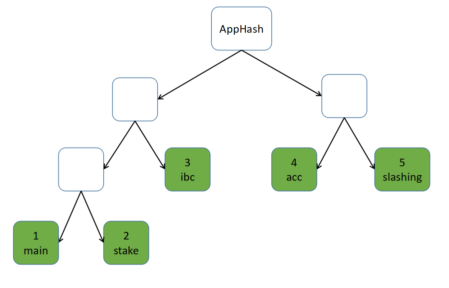
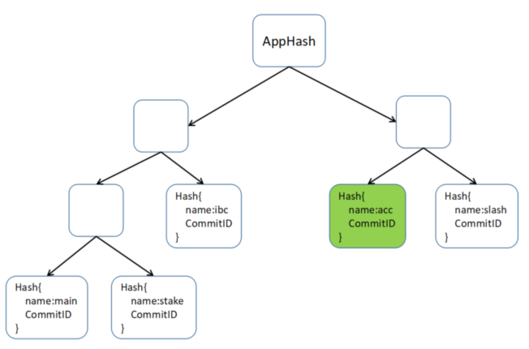
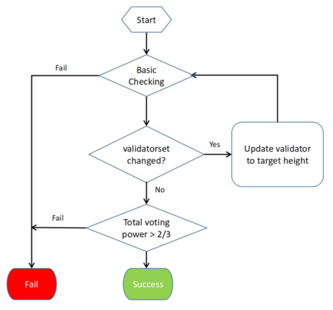
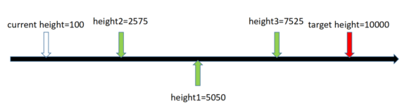

# Specifications

规范

This specification describes how to implement the LCD. LCD supports modular APIs. Currently, only
ICS0 (TendermintAPI), ICS1 (Key API) and ICS20 (Token API) are supported. Later, if necessary, more
APIs can be included.

本文档描述了如何实现LCD, LCD支持模块化的APIs, 当前, 只支持ICS0, IS1, ICS20. 后面如果需要的话, 将会支持更多的API


## Build and Verify Proof of ABCI States

As we all know,  storage of cosmos-sdk based application contains multi-substores. Each substore is
implemented by a IAVL store. These substores are organized by simple Merkle tree. To build the tree,
we need to extract name, height and store root hash from these substores to build a set of simple
Merkle leaf nodes, then calculate hash from leaf nodes to root. The root hash of the simple Merkle
tree is the AppHash which will be included in block header.

我们已经指导, 基于cosmos-sdk的应用程序包含了多个子sotre(substores). 每个子存储都是通过IAVL sotre实现. 这些子存储被组织为`simple Merkle tree`(简单默克尔树).为了构建这棵树, 我们需要获取名字,高度,以及子存储的根hash以构建一个叶子节点. simple merkle tree 的根hash是AppHash, apphash会包含进区块头.



As we have discussed in LCD trust-propagation,
the AppHash can be verified by checking voting power against a trusted validator set. Here we just
need to build proof from ABCI state to AppHash. The proof contains two parts:

根据我们已经讨论过的 LCD的信任传播(trust-propagation), apphash可以用使用一个可信的验证节点集合的投票权重进行验证.我们只需要构造ABCI状态到apphash证明即可. 这个证明包含了年部分:

* IAVL proof    (IAVL证明)
* Substore to AppHash proof  (子存储到apphash的证明)


### IAVL Proof

The proof has two types: existence proof and absence proof. If the query key exists in the IAVL
store, then it returns key-value and its existence proof. On the other hand, if the key doesn't
exist, then it only returns absence proof which can demonstrate(演示) the key definitely doesn't exist.

这个证明包含两种类型: 存在证明(existence proof)和缺席证明(absence proof). 如果查询的key存在与IAVL store中, 它会返回key-alue和存在证明. 另一方面, 如果key不存在, 则返回缺席证明. 缺席证明可以演示key确实不存在.

### IAVL Existence Proof

```go
type CommitID struct {
    Version int64
    Hash    []byte
}

type storeCore struct {
    CommitID CommitID
}

type MultiStoreCommitID struct {
    Name string
    Core storeCore
}

type proofInnerNode struct {
    Height  int8
    Size    int64
    Version int64
    Left    []byte
    Right   []byte
}

type KeyExistsProof struct {
    MultiStoreCommitInfo []MultiStoreCommitID //All substore commitIDs
    StoreName string //Current substore name
    Height  int64 //The commit height of current substore
    RootHash cmn.HexBytes //The root hash of this IAVL tree
    Version  int64 //The version of the key-value in this IAVL tree
    InnerNodes []proofInnerNode //The path from to root node to key-value leaf node
}
```

The data structure of exist proof is shown as above. The process to build and verify existence proof
is shown as follows:


Steps to build proof:

* Access the IAVL tree from the root node.
* Record the visited nodes in InnerNodes,
* Once the target leaf node is found, assign leaf node version to proof version
* Assign the current IAVL tree height to proof height
* Assign the current IAVL tree rootHash to proof rootHash
* Assign the current substore name to proof StoreName
* Read multistore commitInfo from db by height and assign it to proof StoreCommitInfo

Steps to verify proof:

* Build leaf node with key, value and proof version.
* Calculate leaf node hash
* Assign the hash to the first innerNode's rightHash, then calculate first innerNode hash
* Propagate the hash calculation process. If prior innerNode is the left child of next innerNode, then assign the prior innerNode hash to the left hash of next innerNode. Otherwise, assign the prior innerNode hash to the right hash of next innerNode.
* The hash of last innerNode should be equal to the rootHash of this proof. Otherwise, the proof is invalid.

### IAVL Absence Proof

As we all know, all IAVL leaf nodes are sorted by the key of each leaf nodes. So we can calculate
the position of the target key in the whole key set of this IAVL tree. As shown below, we can find
out the left key and the right key. If we can demonstrate(演示) that both left key and right key
definitely exist, and they are adjacent(相邻) nodes. Thus the target key definitely doesn't exist.


If the target key is larger than the right most leaf node or less than the left most key, then the
target key definitely doesn't exist.


```go
type proofLeafNode struct {
    KeyBytes   cmn.HexBytes
    ValueBytes cmn.HexBytes
    Version    int64
}

type pathWithNode struct {
    InnerNodes []proofInnerNode
    Node proofLeafNode
}

type KeyAbsentProof struct {
    MultiStoreCommitInfo []MultiStoreCommitID
    StoreName string
    Height  int64
    RootHash cmn.HexBytes
    Left  *pathWithNode // Proof the left key exist
    Right *pathWithNode  //Proof the right key exist
}
```

The above is the data structure of absence proof. Steps to build proof:

* Access the IAVL tree from the root node.
* Get the deserved index(Marked as INDEX) of the key in whole key set.
* If the returned index equals to 0, the right index should be 0 and left node doesn't exist
* If the returned index equals to the size of the whole key set, the left node index should be INDEX-1 and the right node doesn't exist.
* Otherwise, the right node index should be INDEX and the left node index should be INDEX-1
* Assign the current IAVL tree height to proof height
* Assign the current IAVL tree rootHash to proof rootHash
* Assign the current substore name to proof StoreName
* Read multistore commitInfo from db by height and assign it to proof StoreCommitInfo

Steps to verify proof:

* If only right node exist, verify its exist proof and verify if it is the left most node
* If only left node exist, verify its exist proof and verify if it is the right most node.
* If both right node and left node exist, verify if they are adjacent.

### Substores to AppHash Proof

After verify the IAVL proof, then we can start to verify substore proof against AppHash. Firstly,
iterate MultiStoreCommitInfo and find the substore commitID by proof StoreName. Verify if yhe Hash
in commitID equals to proof RootHash. If not, the proof is invalid. Then sort the substore
commitInfo array by the hash of substore name. Finally, build the simple Merkle tree with all
substore commitInfo array and verify if the Merkle root hash equal to appHash.



```go
func SimpleHashFromTwoHashes(left []byte, right []byte) []byte {
    var hasher = ripemd160.New()

    err := encodeByteSlice(hasher, left)
    if err != nil {
        panic(err)
    }

    err = encodeByteSlice(hasher, right)
    if err != nil {
        panic(err)
    }

    return hasher.Sum(nil)
}

func SimpleHashFromHashes(hashes [][]byte) []byte {
    // Recursive impl.
    switch len(hashes) {
        case 0:
            return nil
        case 1:
            return hashes[0]
        default:
            left := SimpleHashFromHashes(hashes[:(len(hashes)+1)/2])
            right := SimpleHashFromHashes(hashes[(len(hashes)+1)/2:])
            return SimpleHashFromTwoHashes(left, right)
    }
}
```

## Verify block header against validator set

Above sections refer appHash frequently. But where does the trusted appHash come from? Actually,
the appHash exist in block header, next we need to verify blocks header at specific height against
LCD trusted validator set. The validation flow is shown as follows:



When the trusted validator set doesn't match the block header, we need to try to update our
validator set to the height of this block. LCD has a rule that each validator set change should not
affect more than 1/3 voting power. Compare with the trusted validator set, if the voting power of
target validator set changes more than 1/3. We have to verify if there are hidden validator set
changes before the target validator set. Only when all validator set changes obey this rule, can our
validator set update be accomplished.

For instance:



* Update to 10000, tooMuchChangeErr
* Update to 5050,  tooMuchChangeErr
* Update to 2575, Success
* Update to 5050, Success
* Update to 10000,tooMuchChangeErr
* Update to 7525, Success
* Update to 10000, Success
