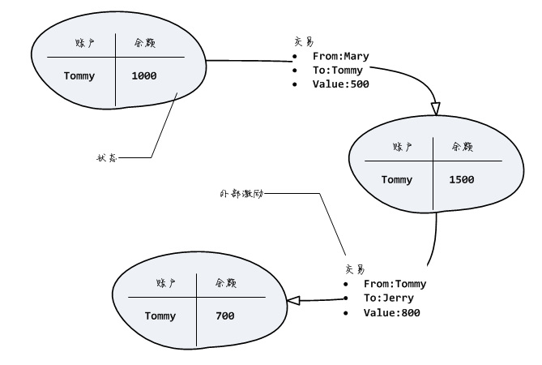

> 原文链接: http://xc.hubwiz.com/course/5bdec63ac02e6b6a59171df3 
>
> 本文是根据原文整理修改而成, 仅用于学习交流, 不可用于商业用途.

## 0 目录内容说明

- doc/tendermint_tutorial 
  - code : 教程原始示例代码
  - tendermint_tutorial.docx : 教程原始文档
- BlockchainNotesV2/tendermint
  - mytokenapp : 本人根据示例代码所写的代码


## 1 概述

### 1.1 tendermint简介
tendermint是一个开源的完整的区块链实现，可以用于公链或联盟链，其官方定位 是面向开发者的区块链共识引擎：


与其他区块链平台例如以太坊或者EOS相比，tendermint最大的特点是其差异化的定位： 尽管包含了区块链的完整实现，但它却是以SDK的形式将这些核心功能提供出来，供开发者 方便地定制自己的专有区块链：


tendermint的SDK中包含了构造一个区块链节点的绝大部分组件，例如加密算法、共识算法、 区块链存储、RPC接口、P2P通信等等，开发人员只需要根据其应用开发接口 （Application Blockchain Communication Interface）的要求实现自己 的应用即可。

ABCI是开发语言无关的，开发人员可以使用自己喜欢的任何语言来开发基于tendermint的 专用区块链。不过由于tendermint本身是采用go语言开发的，因此用go开发ABCI应用的一个额外好处 就是，你可以把tendermint完整的嵌入自己的应用，干净利落地交付一个单一的可执行文件。

阅读教程，从下面说法中选择正确的陈述：

- tendermint只是一个共识引擎，没有完整实现区块链

- 基于tendermint的应用只能用go语言开发

- ACBI是tendermint和应用之间的通信接口

 

### 1.2 tendermint的共识算法
在技术方面，tendermint引以为傲的是其共识算法 —— 世界上第一个可以应用于公链的拜占庭 容错算法。tendermint曾于2016年国际区块链周获得最具创新奖，并在Hyperledger的雨燕（Burrow） 等诸多产品中被采纳为共识引擎。你可以点击 这里 查看其应用案例。

tendermint采用的共识机制属于一种权益证明（ Proof Of Stake）算法，一组验证人 （Validator）代替了矿工（Miner）的角色，依据抵押的权益比例轮流出块：

 

由于避免了POW机制，tendermint可以实现很高的交易吞吐量。根据官方的说法，在 合理（理想）的应用数据结构支持下，可以达到42000交易/秒，引文参考 这里。 不过在现实环境中，部署在全球的100个节点进行共识沟通，实际可以达到1000交易/秒。

tendermint同时是拜占庭容错的（Byzantine Fault Tolerance），因此对于3f+1个 验证节点组成的区块链，即使有f个节点出现拜占庭错误，也可以保证全局正确共识的达成。同时 在极端环境下，tendermint在交易安全与停机风险之间选择了安全，因此当超过f个验证节点发生 故障时，系统将停止工作。

什么是拜占庭错误？简单的说就是任何错误：既包括节点宕机、也包括恶意节点的欺骗和攻击。

tendermint共识机制的另一个特点就是其共识的最终确定性：一旦共识达成就是真的达成， 而不是像比特币或以太坊的共识是一种概率性质的确定性，还有可能在将来某个时刻失效。 因此在tendermint中不会出现区块链分叉的情况。

阅读教程，从以下关于tendermint的共识算法的陈述中选择正确的说法：

- tendermint采用了工作量证明机制（POW）

- 4个tendermint验证节点组成的区块链，当其中2个同时失效时，依然可以正常工作

- tendermint区块链不会分叉

 

### 1.3 tendermint vs.以太坊
tendermint的定位决定了在最终交付的节点软件分层中，应用程序占有相当部分的分量。 让我们通过与以太坊的对比来更好地理解这一点：

 

在上图中，tendermint结构中的abci应用和以太坊结构中的智能合约，都是由用户代码实现的。 显然，`ABCI`应用大致与EVM+合约的组合相匹配。

在以太坊中，节点是一个整体，开发者提供的智能合约则运行在受限的虚拟机环境中；而在 tendermint中，并不存在虚拟机这一层，应用程序是一个标准的操作系统进程，不受任何 的限制与约束 —— 听起来这很危险，但当你考虑下使用tendermint的目的是构建专有的区块链 时，这种灵活性反而更有优势了。

事实上，tendermint留下的应用层空间如此之大，以至于你完全可以在`ABCI`应用中实现一个 EVM，然后提供solidity合约开发能力，这就是超级账本的 [Burrow](https://cn.hyperledger.org/projects/hyperledger-burrow) 做的事情。

阅读教程，回答以下问题：

- 你觉得tendermint的应用场景有哪些？

### 1.4 课程内容概述
本课程适合希望开发自己的专有区块链的go语言工程师，课程内容如下：

第一章 课程简介

简单介绍tendermint的定位、特点以及对于开发者而言tendermint与以太坊的区别。

第二章 初识tendermint

tendermint本身是一个完整的区块链实现，本章介绍tendermint的主要组成部分，包括 节点软件的使用、最小ABCI应用编写以及RPC API开发接口。

第三章 应用开发模型

tendermint是一个标准的状态机复制模型的实现，因此基于tendermint的应用就是一个 标准的分布式状态机。本章通过一个分布式计数器的开发来学习基于ABCI接口的应用开发。

第四章 去中心化身份识别机制

本章介绍如何基于非对称加密技术实现去中心化的身份识别。课程的内容包括非对称密钥 的生成、身份验证原理与实现、哈希地址计算等。

第五章 案例：代币发行

代币是区块链的一种典型应用。在这一章里我们通过发行代币来进一步深入学习基于tendermint 的状态机应用的设计与实现。

第六章 代币案例：使用默克尔树

merkle树是区块链中经常使用的一种数据结构，在这一章我们将学习其原理、用途与使用方法， 并使用它增强代币案例的功能。

第七章 代币案例：使用多版本状态库

在区块链的每个高度都对应着应用状态的特定历史快照。本章介绍如何使用tendermint的 多版本状态库iavl来实现应用状态的管理。

第八章 多节点组网

本章介绍如何进行多个tendermint节点/应用的组网。


## 2 初识tendermint

### 2.1 概述
tendermint虽然定位于引擎，但它其实是一个完整的区块链实现。在这一部分 的课程中，我们将使用一个最小化的ABCI应用，来熟悉tendermint的主要组成 部分，以及使用tendermint进行去中心化应用开发的主要流程和工具。

下图列出了tendermint应用的主要构成部分：

 

tendermint提供了一个预构建的同名可执行程序，我们将学习如何使用这个程序 来初始化节点配置文件并启动节点。这个程序是完整的节点实现，除了通过P2P协议 与其他节点交换共识，同时还提供了RPC接口供客户端提交交易或者查询应用状态。

我们将创建一个最小化的ABCI应用，tendermint可执行程序通过ABCI接口与 应用程序交互，例如要求应用执行交易、或者转发来自RPC接口的状态查询请求。

阅读教程，从以下陈述中选择正确的说法：

- tendermint程序启动后可以与其他节点通过p2p协议交换信息

- tendermint程序和应用程序之间通过ABCI接口交换信息

- `curl`可以通过tendermint程序的rpc接口查询应用状态

 

tendermint 安装

> 参考官方文档: https://docs.tendermint.com/master/introduction/install.html

```
1.安装go环境 , 我的go版本是 go version go1.15.2 linux/amd64

2.编译tendermint
git clone https://github.com/tendermint/tendermint.git
cd tendermint
make tools
make install     #安装在 $GOPATH/bin
make build     #可执行文件在 ./build
tendermint version    #我的tenderminet版本是: 0.33.8-1a8e42d4    2020-10
```


### 2.2 节点初始化
tendermint节点程序的行为非常依赖于配置文件，使用其`init`子命令 可以获得一组默认的初始化文件。 例如，在1#终端输入如下命令创建初始化文件：

`~$ tendermint init`

`init`子命令将在`~/.tendermint`目录下创建两个子目录`data`和`config`，分别用于 保存区块链数据和配置文件。

```
$ tree .
.
├── config
│   ├── config.toml
│   ├── genesis.json
│   ├── node_key.json
│   └── priv_validator_key.json
└── data   
    ├── priv_validator_state.json
    ├── blockstore.db   
    ├── cs.wal
    ├── evidence.db
    ├── state.db
    └── tx_index.db
```


执行`init`命令后在`config`子目录下将包含如下的配置文件：

- `config.toml`：节点软件配置文件
- `node_key.json`：节点密钥文件，用于p2p通信加密
- `priv_validator_key.json`：验证节点密钥文件，用于共识签名
- `genesis.json`：创世文件
- `addrbook.json`: 用于保存 p2p节点地址

当节点启动之后, 在`data`目录下将包含如下的数据文件，均为`leveldb`格式：

- `blockstore.db`：区块链数据库

- `evidence.db`：节点行为数据

- `state.db`：区块链状态数据

- `tx_index.db`：交易索引数据

节点配置文件`config.toml`用来设置节点软件的运行参数，例如RPC监听端口等。 我们修改`consensus.create_empty_blocks`为`false`，即不出无交易的空块：

```
[consensus]
create_empty_blocks = false
```


重新初始化

在我们开发ABCI应用的过程中，往往需要对应用中的状态结构等信息进行调整，再次重新启动 后就可能导致原有的链数据和新的状态结构不兼容，因此需要时不时地重新初始化区块链数据。

当然你可以完全删除`~/.tendermint`目录，然后重新执行`tendermint init`命令。不过官方 的建议是使用`unsafe_reset_all`子命令来做这个事情，这个命令可以保留现有的配置而仅删除 数据文件。例如：

`~$ tendermint unsafe_reset_all`

参考教程，完成以下任务：

- 执行`init`子命令初始化节点配置

- 修改`config.toml`中的参数，使节点不主动构造无交易空块

 

### 2.3 节点启动与停止
初始化之后，我们就可以启动节点了。在1#终端执行`node`子命令启动tendermint节点：

`~$ tendermint node`

可以看到tendermint在反复尝试abci应用的默认监听地址`tcp://127.0.0.1:26658`：

 

显然，tendermint要求一个配套的abci应用才能正常工作，我们将在下一节解决这个 问题。

在目前这种状态下，如果需要退出tendermint的执行，可以切换到2#终端，使用`pkill` 命令终止其运行：

`~$ pkill -9 tendermint`

参考教程，完成以下任务：

- 启动节点，观察其尝试连接abci应用的行为

- 终止节点运行

 

### 2.4 编写最小化应用
tendermint开发包中已经包含了一个基本的ABCI应用实现类`BaseApplication`， 可以完成与tendermint节点的基本交互：

 

tendermint节点程序可以通过socket通信访问ABCI应用，因此我们使用`abci/server` 包的`NewServer()`函数创建一个`SocketServer`实例来启动这个应用。

例如，下面的代码在tendermint尝试连接的默认端口`26658`启动`abci`应用：

```go
package main

import (
  "fmt"
  "github.com/tendermint/tendermint/abci/types"
  "github.com/tendermint/tendermint/abci/server"
)

func main(){
  app := types.NewBaseApplication()
  svr,err := server.NewServer(":26658","socket",app)
  if err != nil { panic(err) }
  svr.Start()
  defer svr.Stop()
  fmt.Println("abci server started")
  select {}
}
```


`$ go run miniapp.go`

现在回到1#终端重新启动tendermint节点：

`~$ tendermint node`

你可以看到这次tendermint节点启动成功了：

 

### 2.5 RPC开发接口
在一个典型的（非理想化的）去中心化应用的开发中，除了需要开发链上应用 （例如ABCI应用或者以太坊中的智能合约），往往还需要开发传统的网页应用 /桌面应用/手机应用，以方便那些不可能自己部署节点的用户：

 

和以太坊一样，tendermint的节点也提供了RPC接口供这些传统应用代码访问节点功能， 例如提交交易或者查询节点状态，其默认的RPC监听端口是26657。

首先确保1#终端和2#终端分别运行着tendermint和abci应用，然后我们切换到3# 终端，输入如下命令提交交易0x68656c6c6f —— 对应于字符串hello的16进制表示：

```
yqq@ubuntu:miniapp$ curl http://localhost:26657/broadcast_tx_commit?tx=0x68656c6c6f
{
  "jsonrpc": "2.0",
  "id": -1,
  "result": {
    "check_tx": {
      "code": 0,
      "data": null,
      "log": "",
      "info": "",
      "gasWanted": "0",
      "gasUsed": "0",
      "events": [],
      "codespace": ""
    },
    "deliver_tx": {
      "code": 0,
      "data": null,
      "log": "",
      "info": "",
      "gasWanted": "0",
      "gasUsed": "0",
      "events": [],
      "codespace": ""
    },
    "hash": "2CF24DBA5FB0A30E26E83B2AC5B9E29E1B161E5C1FA7425E73043362938B9824",
    "height": "3"
  }

```

响应结果类似于下图，其中check_tx和deliver_tx来自于abci应用，而交易哈希 和区块高度则由tendermint节点内部处理得出：

 

事实上，由于BaseApplication对于交易数据没有任何的限制，因此我们可以提交 任意有效的16进制表示，而这些交易都将成功地打包到区块里。

让我们看一下这个区块的内容，在3#终端输入如下命令：

```
yqq@ubuntu:miniapp$ curl http://localhost:26657/block?height=3
{
  "jsonrpc": "2.0",
  "id": -1,
  "result": {
    "block_id": {
      "hash": "11F700F7511BCA20C6E5512C23C15DF208A7BD2A7D6EFAB6204CC13F590F4756",
      "parts": {
        "total": "1",
        "hash": "BC011D26EFC1393272161589BD06073CABECB2BEEF8ADD50A8F0C7F4302B2310"
      }
    },
    "block": {
      "header": {
        "version": {
          "block": "10",
          "app": "0"
        },
        "chain_id": "test-chain-7rOpch",
        "height": "3",
        "time": "2020-10-23T06:33:34.652743488Z",
        "last_block_id": {
          "hash": "CBAC1F877D9E1A506B38D27C543B7FD4D83B098AB91E557EEAAAB64FB5241E6D",
          "parts": {
            "total": "1",
            "hash": "3F5D9A7428F0B3F0664DBA852C81759EAB9E6AFDD0B2832FA40A613174EB28EB"
          }
        },
        "last_commit_hash": "8B315AE8182B051ABD6536F616FDB6F89DAB4D311E1228B9BC4E8E0C09D82FED",
        "data_hash": "07636CA803346B2298B02D2C35146D6F18FB848E06B873D3367A51FA4C89B8A1",
        "validators_hash": "8437952A9F8B81FAB1777C6C912735A2478FB4F836D84AF0B00F5384C8FD9A1C",
        "next_validators_hash": "8437952A9F8B81FAB1777C6C912735A2478FB4F836D84AF0B00F5384C8FD9A1C",
        "consensus_hash": "048091BC7DDC283F77BFBF91D73C44DA58C3DF8A9CBC867405D8B7F3DAADA22F",
        "app_hash": "",
        "last_results_hash": "",
        "evidence_hash": "",
        "proposer_address": "81E78A08417B855F1BDE8239748C8C2CD0A30C99"
      },
      "data": {
        "txs": [
          "aGVsbG8="   //交易内容
        ]
      },
      "evidence": {
        "evidence": null
      },
      "last_commit": {
        "height": "2",
        "round": "0",
        "block_id": {
          "hash": "CBAC1F877D9E1A506B38D27C543B7FD4D83B098AB91E557EEAAAB64FB5241E6D",
          "parts": {
            "total": "1",
            "hash": "3F5D9A7428F0B3F0664DBA852C81759EAB9E6AFDD0B2832FA40A613174EB28EB"
          }
        },
        "signatures": [
          {
            "block_id_flag": 2,
            "validator_address": "81E78A08417B855F1BDE8239748C8C2CD0A30C99",
            "timestamp": "2020-10-23T06:33:34.652743488Z",
            "signature": "WuZbHa2V76UOlcEaPvWgg0sILzNOal2++epL2nmQyCqnaAzOD7xdpV0G/stkosu5WZHwqReTJjbwQli1PvZdDA=="
          }
        ]
      }
    }
  }
}
```


注意结果中的Txs字段，它包含了该区块中所有交易的base64编码：

 

我们可以使用命令行工具base64简单地进行验证：

`~$ echo aGVsbG8= | base64 -d`

可以访问这里 查看tendermint区块结构的详细说明。

也可以通过哈希查看交易内容，在3#终端输入如下命令（注意，你的哈希可能与此不同）：

`~$ curl http://localhost:26657/tx?hash=0x2CF24DBA5FB0A30E26E83B2AC5B9E29E1B161E5C`

得到如下的结果：

 

参考教程，在1#终端和2#终端分别启动tendermint节点和abci应用，然后在3#终端完成以下任务：

- 提交一个交易，内容为：0x787878（对应于字符串xxx），观察其响应中的区块高度与交易哈希

- 查看该高度区块的内容，并解码其中的交易

- 利用该交易哈希查看其内容

 

 

由于我们只有一个节点，因此tendermint会抱怨连接不到其他的节点，it‘s ok。

参考教程，完成以下任务：

- 在`~/repo/go/src/diy/c2`目录下创建`mini-app.go`文件，实现教程中的abci应用

- 在`2#`终端运行`mini-app.go`

- 在`1#`终端启动tendermint程序，观察输出日志，确认节点启动成功

 

 

## 3 状态机与ABCI
### 3.1 状态机
tendermint采用的分布式计算模型为状态机复制（State Machine Replication），其基本 思路就是通过在多个节点间通过同步输入序列来保证各节点状态机的同步。

状态机是一种在通信软件、游戏、工业控制等领域应用非常广泛的计算模型，用来抽象地表示一个 系统的演化过程。状态机由一组（有限或无限的）状态以及激发状态迁移的外部输入组成， 对于确定性状态机而言，在某一个时刻一定处于一个确定的状态，而在一个状态下 针对特定输入的状态迁移也是确定的。

现在让我们看一个计数器的状态以及其变化情况，在某一个特定时刻其状态为特定的数值：

 

显然，计数器有无限个状态（1,2,3...），但只有三个触发动作：

- inc - 递增

- dec - 递减 、

- reset - 复位

当涉及到区块链时，这些来自状态机外部的触发动作通常被称为交易/Transaction， 将被永久性地保存在区块链上，成为区块链不可篡改特性的一个基石。

阅读教程，从以下陈述中选择正确的说法：

- 计数器是一个确定性状态机

- 状态机在没有外部触发时，状态不会变化

- 多个输入的先后顺序，对状态机的状态变化没有影响

 

### 3.2 状态机复制
状态机复制是指在多个节点中的状态机保持一致，彼此互为副本，无论客户端访问哪一个 节点，都能得到同样的状态；无论客户端向哪一个节点提交交易，也都能保证各节点可以 最终过渡到一致的新状态。

尽管是显而易见的，但依然值得指出，只有确定性状态机才可以利用状态机 复制模型实现分布式共识。

显然，当任意一个节点收到交易请求时，首先需要与其他节点进行协调，确认达成一致意见后， 再分别于不同的节点执行同样的交易序列 —— 状态机复制就是通过在各节点之间保持交易序列 （状态机的外部输入）的一致次序来保证最终状态的一致性的，而节点间协调的过程，就是我们 所说的共识算法。

下图反映了tendermint作为共识引擎时，RPC客户端、tendermint程序和abci应用 三者之间（简化）的交互时序：

 

当RPC客户端提交一个新的交易后，该交易首先进入tendermint的交易池，然后tendermint将与 其他节点就要执行哪些交易的问题通过p2p协议进行协调，达成共识后，tendermint才会通知应用状态机 执行交易更新状态。

显然，在整个状态机复制模型中，作为状态机的ABCI应用是被动的，它只需要响应来自共识引擎 的ACBI消息，并执行相应的动作即可。

阅读教程，回答以下问题：

- 在状态机复制模型中，共识算法达成的是输入次序的一致性，还是应用状态的一致性？

- 为什么说只有确定性状态机才可以实现分布式共识？

### 3.3 ABCI接口概述
tendermint将ABCI协议交互过程进行了封装，开发者只需要实现Application接口，等待tendermint 在合适的时机调用就可以了：

 

上图列出了Application接口约定的方法，每个方法对应于一个特定的`ABCI`消息：

- **`Info`**：当tendermint与`ABCI`应用建立初始连接时，将发送`Info`请求消息尝试获取应用状态对应的区块 高度、状态哈希等信息，以确定是否需要重放（replay）区块交易。

- **`Query`**：当RPC客户端发出`abci_query`调用时，tendermint将通过`Query`请求消息转发给`ABCI`应用，并将响应结果转发回RPC客户端。

- **`CheckTx`**：当tendermint从RPC接口或p2p端口收到新的交易时，首先会通过`CheckTx`请求消息提给`ABCI`应用 进行初步检查，确认该交易是否合规。只有`ABCI`应用确认有效的消息才会进入tendermint的交易池等待下一步的共识确认。

- **`InitChain`**：当创建创世块时，tendermint会发送`InitChain`请求消息给`ABCI`应用，可以在此刻进行 应用状态机的状态初始化。

- **`BeginBlock/EndBlock`**：当tendermint就新区块交易达成共识后，将通过`BeginBlock`请求开始启动`ABCI`应用 的交易执行流程，并以`EndBlock`请求作为交易执行流程的结束。

- **`DeliverTx`**：在`BeginBlock`和`EndBlock`请求之间，tendermint会为区块中的每一个交易向`ABCI`应用 发出一个`DeliverTx`请求消息，这是应用状态机更新的时机。

- **`Commit`**：作为执行交易的最后一步，tendermint会发送`Commit`请求，并在获取响应后持久化区块状态。

我们可以重写特定的接口方法来观察ABCI消息的执行，例如，下面的代码重写BeginBlock()方法来 打印BeginBlock请求消息：

```go
type EzApp struct {   
    types.BaseApplication 
}

func (app *EzApp) BeginBlock(req types.RequestBeginBlock) types.ResponseBeginBlock{
  fmt.Printf("beginblock => %v\n",req)
  return types.ResponseBeginBlock{}
}
```


在预置代码`~/repo/go/src/hubwiz.com/c3/msg-dump.go`中拦截并打印所有的ABCI消息，可以 按以下步骤运行来观察当一个交易提交后，ABCI应用收到的消息：

首先在1#终端启动tendermint：

`~$ tendermint node`

然后在2#终端启动msg-dump.go：

`~$ cd ~/repo/go/src/hubwiz.com/c3`

`~/repo/go/src/hubwiz.com/c3$ go run msg-dump.go`

切换到3#终端执行命令：

`$ curl http://localhost:26657/broadcast_tx_commit?tx=0x787878`

然后返回2#终端查看屏幕输出。

参考教程，使用预置代码msg-dump.go观察ABCI消息，并回答：当提交一个交易后， 以下ABCI消息的先后顺序是否正确？

BeginBlock -> CheckTx -> DeliverTx -> EndBlock -> Commit

 

### 3.4 交易检查：CheckTx
为了减轻共识环节的工作负担，对于通过rpc接口提交的交易，tendermint引入了交易检查环节，只有检查成功的交易才能够进入交易池等待确认，否则直接拒绝：


例如，下面的代码检查交易是否为指定的三种交易之一（0x01 - inc，0x02 - dec ,0x03 - reset）， 否则拒绝：

```go
func (app *EzApp) CheckTx(tx []byte) types.ResponseCheckTx{
  if tx[0]  < 0x04 {
  	return types.ResponseCheckTx{}
  }
  return types.ResponseCheckTx{Code:1,Log:"bad tx rejected"}
}
```

`CheckTx()`方法返回的是一个`ResponseCheckTx`结构，其组成与`ResponseDeliverTx` 相同：

 

同样，结构中只有Code是必须的，为0值时表示交易执行成功，不同的非0值的失败含义由 应用自行定义。

现在，当我们对修改过的ABCI应用试图提交如下的交易时，将发生错误：

`~$ curl http://localhost:26657/broadcast_tx_commit?tx=0x78`

结果如下：

 

交易的唯一性要求

为了对抗重放攻击，以及避免节点间反弹的重复消息引起共识过程死循环，tendermint在 触发`CheckTx()`之前会使用一个缓存拒绝近期已经出现过的交易。因此当你试图重复提交 一个交易时，将提示该交易已经存在的错误：tx already exists in cache。

解决的办法就是为交易附加一个序列号，以保证交易的唯一性。例如，当我们使用0x01表示 inc交易时，可以如下的方式多次提交交易：

`~$ curl http://localhost:26657/broadcast_tx_commit?tx=0x0101`

`~$ curl http://localhost:26657/broadcast_tx_commit?tx=0x0102`

`~$ curl http://localhost:26657/broadcast_tx_commit?tx=0x0103`

交易序列号的设计完全取决于特定的应用，tendermint只是简单地拒绝已经在缓存中的交易。

参考教程，编写abci应用完成以下任务：

- 使用`CheckTx`拦截所有第一个字节不是0x78的交易

- 运行tendermint和abci应用，然后使用curl提交若干可以通过检查的交易

- 注意交易唯一性的问题

### 3.5 交易执行:DeliverTx
计数器应用只有一个要维护的状态（计数值），因此第一版的实现很简单，我们 只需要在`DeliverTx`方法中检查交易类型，然后增减或复位成员变量`Value`即可：

```go
type CounterApp struct{
  types.BaseApplication
  Value int64
}

func (app *CounterApp) DeliverTx(tx []byte) types.ResponseDeliverTx{
  switch tx[0] {
    case 0x01: app.Value += 1
    case 0x02: app.Value -= 1
    case 0x03: app.Value = 0
    default: return types.ResponseDeliverTx{Code:0,Log:"bad tx"}
  }
  info := fmt.Printf("value updated : %v",app.Value)
  return types.ResponseDeliverTx{Info: info}
}
```

`DeliverTx()`方法的返回结果是一个`ResponseDeliverTx`结构，其定义如下：

 

结构中只有Code是必须的，为0值时表示交易执行成功，不同的非0值的失败含义由 应用自行定义。

参考教程与示例代码，编写abci应用完成以下任务：

- 当提交0x01交易时，计数器值加1

- 当提交0x02交易时，计数器值减1

- 当提交0x03交易时，计数器值清零

- 当提交非以上交易时，拒绝交易

### 3.6 状态初始化:InitChain
当tendermint准备构建创始区块时，将向abci应用发送`InitChain`消息，同时在该消息 请求中可以携带创世文件`genesis.json`中应用特定的初始化状态数据（app_byte）， 因此是应用进行状态初始化的好时机：

 

例如，下面的代码将计数状态从100开始：

```go
func (app *CounterApp) InitChain(req types.RequestInitChain) types.ResponseInitChain{
  app.Value = 100
  return types.ResponseInitChain{}
}
```

在上面的代码中我们直接在`InitChain()`实现中设定了技术初始值100，这当然是可以的，不过 更好的办法是借助于创世文件`genesis.json`，在该文件中声明应用状态的初始值。

例如，下面展示了`genesis.json`中的内容：

```json
{

  "genesis_time": "2018-10-30T00:42:47.699648591Z",
  "chain_id": "test-chain-wx5RA8",
  "app_hash": "",
  "app_state": {"counter":100}
}
```

`app_state`字段的内容将以原始字节码的形式在`InitChain`请求的`AppStateBytes`字段传入， 因此，我们改为如下的实现：

```go
func (app *CounterApp) InitChain(req types.RequestInitChain) types.ResponseInitChain{
  var state map[string]int
  json.Unmarshal(req.AppStateBytes,&state)
  app.Value = state["counter"]
  return types.ResponseInitChain{}
}
```

参考教程和示例代码，编写abci应用完成以下任务：

- 在`genesis.json`中设置应用计数器初值为`200`

- 重写`InitChain()`方法，使用`genesis.json`中的应用状态参数设置计数状态初值

### 3.7 应用状态查询：Query
RPC客户端可以利用节点的`abci_query`调用查询ABCI应用维护的状态，该调用允许在请求 中设定查询条件，以过滤潜在的查询结果：

 

对于我们的计数状态机而言，由于只有一个状态Value，因此直接返回它的当前值即可：

```go
func (app *CounterApp) Query(req types.RequestQuery) types.ResponseQuery{
  val := fmt.Sprintf("%d",app.Value)
  return types.ResponseQuery{Value: []byte(val)}
}
```

`Query()`的参数是一个`RequestQuery`结构，用来指定查询条件，由于我们只有一个状态 值得返回，因此暂时先忽略它。

`Query()`的返回结果是一个`ResponseQuery`结构，其定义如下：

 

同样，结构中只有`Code`是必须的，为0值时表示交易执行成功，不同的非0值的失败含义由 应用自行定义即可。对于计数应用，我们使用`Value`字段来返回当前状态值。

现在可以使用`abci_query`来查询应用状态了：

`~$ curl http://localhost:26657/abci_query`

`abci_query`返回的value是base64编码的：

 

我们可以用base64解码value字段的值：

`~$ echo MQ== |  base64 -d`

参考教程和示例代码，编写abci应用完成以下任务：

- 重写`Query()`方法，返回当前状态值

- 运行tendermint和abci应用，使用curl查看状态值

 

### 3.8 应用状态的历史
现在观察`RequestQuery`的结构，注意其Height字段：

 

对于状态机而言，当一个新的区块产生，其中的交易就会导致状态的迁移，因此状态是 与区块存在着对应关系 —— 在不同的区块高度，对应着状态机的不同状态：

 

因此对于ABCI应用而言，应当记录状态的历史变化，每一个区块高度，对应着不同版本的状态：

```go
type CounterApp struct {
  types.BaseApplication
  Value int64
  Version int64
  History map[int64]int64
}
```

我们在`Commit()`方法中递增`Version`（以便和区块高度保持一致），并记录状态历史：

```go
func (app *CounterApp) Commit() types.ResponseCommit{
  app.Version += 1
  app.History[app.Version] = app.Value
  return types.ResponseCommit{}
}
```

现在，我们可以根据`RequestQuery`中的`Height`值来返回对应版本的状态了，高度`0`意味着要 返回最新区块的状态：

```go
func (app *CounterApp) Query(req types.RequestQuery) types.ResponseQuery {  
  height := req.Height
  if req.Height == 0 {  height = app.Version }
  val := fmt.Sprintf("%d",app.History[height])
  return types.ResponseQuery{Value: []byte(val),Height: height}
}
```

我们现在可以查询历史状态了：

`~$ curl http://localhost:26657/abci_query?height=1`

结果如下：

 

参考教程和示例代码，编写abci应用完成以下任务：

- 实现对递增/递减/复位交易的支持

- 记录每个区块高度时的状态历史

- 实现按区块高度查询应用状态

- 启动tendermint和abci应用，用curl执行若干递增交易，并查询指定高度时的状态

 

### 3.9 应用/区块链握手机制
现在我们的计数应用已经在区块链中有了一些交易记录，也实现了基本的状态更新逻辑， 那么思考一个问题：如果重新启动节点（及ABCI应用），然后再次查询最后区块的状态值， 结果是8还是0？

 

这个问题是有意义的，毕竟我们只是在内存里记录了状态值以及其历史，重新启动后， 内存中的状态数据已经丢失了。

你可以自己尝试一下，不出意外的话，还是会和重新启动之前一样，你得到的状态值 依然是8。

这是因为当tendermint节点连接ABCI应用后，会有一个握手同步的处理，tendermint会向`ABCI`应用发送`Info`消息获取应用状态的最后区块高度，如果`ABCI`应用返回的区块高度小于tendermint节点的最后区块高度，tendermint就会认为`ABCI`应用漏掉了这些区块并进行重放( block replay)：

 

显然，由于我们没有明确处理`Info`消息，因此握手时tendermint会认为我们的计数应用的区块高度为0，所以它会重放所有的区块(所有交易都会被重新执行一遍)，这意味着当重放结束，我们的计数器值还是会回到8。 

> 注意: 如果使用了数据库做了持久化, 那么如果重放所有区块, 就会导致状态不对(例如: 账户的余额部队) 

容易理解，我们不期望每次重新启动节点（及`ABCI`应用）都重放所有区块，那会非常耗时并且体验很差。因此我们可以在`Info()`方法中返回状态机处理过的最后区块高度，你知道它对应于我们的`Version`成员：


```go
func (app *CounterApp) Info(req types.RequestInfo) types.ResponseInfo{
  return types.ResponseInfo{LastBlockHeight:app.Version}
}
```

`Info()`的返回值是一个`ResponseInfo`结构，其成员如下：

 

参考教程和示例代码，编写abci应用完成以下任务：

- 实现递增/递减/复位交易的支持

- 重写`Info()`，在握手时向tendermint节点程序返回状态的最后区块高度

- 启动tendermint和abci应用，提交若干递增交易

- 重新启动tendermint，观察是否还存在重放信息

 

### 3.10 应用状态的哈希值
根据tendermint的约定，ABCI应用在`Commit()`调用时返回当前状态的哈希，会由tendermint 写入下一个区块头中的`app_hash`部分，作为区块链状态的一部分：

 

`apphash`用来表示某个区块时的应用状态特征，哈希函数自然是一个很好的选择，但tendermint 只要求这个值能够表达状态，因此我们理论上可以使用任何与状态相关的确定性的值。例如， 对于计数应用而言，我们可以直接使用计数器的值，因为这个状态本身很简单，不需要提取指纹了。

```go
func (app *CounterApp) Commit() types.ResponseCommit{
  app.Version += 1
  app.Hash = []byte(fmt.Sprintf("%d",app.Value))
  app.History[app.Version] = app.Value  
  return types.ResponseCommit{Data:app.Hash}
}
```

与此同时，在tendermint与abci应用握手时，如果涉及到区块重放，也会检查区块头记录的`AppHash` 与前一区块的`Commit()`返回的结果是否一致，因此，我们调整Info()来返回记录的当前状态的哈希：

```go
func (app *CounterApp) Info(req types.RequestInfo) types.ResponseInfo{
  return types.ResponseInfo{LastBlockHeight:app.Version,LastBlockAppHash:app.Hash }
}
```

> 注意区分 block hash  和  app hash .   

参考教程和示例代码，编写abci应用完成以下任务：

- 将应用状态哈希写入区块

- 在握手时返回最后状态的哈希

 

### 3.11 应用状态持久化
到目前位置，我们的应用状态都是保存在内存里，每次重新启动都会从零开始。 现在考虑把状态持久化到硬盘上。这包括两部分工作：在`Commit()`中保存状态到硬盘、 在创建应用实例时载入硬盘保存的状态。

理论上你可以使用任何存储机制，例如SQL数据库、NoSQL数据库、文件系统等等。 不过为了便于观察，我们采用JSON格式的平文件记录计数值：

```go
func (app *CounterApp) Commit() types.ResponseCommit{
  app.Version += 1
  app.History[app.Version] = app.Value
  state,err := json.Marshal(app)
  if err !=nil { panic(err) }
  ioutil.WriteFile("./counter.state",state,0644)
  return types.ResponseCommit{}
}
```

同时，我们在实例化计数应用时，载入之前的状态：

```go
func NewCounterApp() *CounterApp {
  app := CounterApp{ History:map[int64]int{} }
  state, err := ioutil.ReadFile("./counter.state")
  if err != nil { return &app }
  err = json.Unmarshal(state,&app)
  if err != nil { return &app }
  return &app
}
```

现在我们的状态已经持久化，可以查看一下counter.state的内容：


参考教程和示例代码，编写abci应用完成以下任务：

- 实现递增交易和查询支持

- 实现技术状态持久化

- 启动tendermint和abci应用，并执行若干递增交易，记录最后状态值

- 重新启动tendermint和abci应用，查询状态值

 

## 4  基于非对称加密的身份识别机制

### 4.1 身份识别机制概述

无论是中心化系统，还是去中心化系统，都有一个基本的问题：如何表征与验证用户的身份。

在中心化系统中，这一问题是基于统一存储的用户表来实现的：每个用户在表中都有 一条对应的记录，而系统则通过验证用户输入的用户名和口令是否与用户表中的记录一致来识别 用户的身份：

 

区块链则采用了另外一种不需要集中存储的方案来解决这一问题：每个用户由一对公/私钥来 标识，可以将公钥视为用户名，而私钥视为用户的口令。当用户提交数据时，必须使用自己 的私钥进行签名，这样其他人就可以利用其公钥验证签名数据是否真的来自于该用户。

不过由于公钥比较长，通常会对公钥进行一定的哈希计算，并进行必要的截短，作为区块链上 用户的标识，即我们通常所说的地址。

tendermint提供了两种非对称加密算法的实现：比特币/以太坊采用的secp256k1椭圆曲线算法， 以及tendermint推荐的相对较新的ed25519加密算法，在我们的应用中都可以用来实现身份识别。

阅读教程，从以下陈述中选择正确的说法：

- 区块链采用非对称密钥实现用户身份的表征与识别

- 区块链地址可以从公钥推算出来，不同的地址对应不同的公钥

 

### 4.2 经典算法secp256k1
Secp256k1是指比特币中使用的ECDSA(椭圆曲线数字签名算法)曲线的参数，公/私钥就对应于 该曲线上的点。

在比特币流行之前secp256k1几乎无人使用，但现在已经是无人不知了。secp256k1的参数由于 是精心选择的，因此它的计算会比随机参数的曲线快30%，具有较短的密钥，同时也能显著降低 算法中存在后门的风险。

tendermint内置了`secp256k1`的实现包`crypto/secp256k1`，其中的`PrivKeySecp256k1`和 `PubKeySecp256k1`分别实现了私钥和公钥接口：

 

私钥对应于曲线上点的X坐标。使用`secp256k1`包的`GenPrivKey()`方法可以生成一个32 字节长的随机私钥，例如：

```go
priv := secp256k1.GenPrivKey()

fmt.Printf("private key => %v\n",priv)
```

或者将一个特定的密文转换为私钥，例如：

```go
priv := secp256k1.GenPrivKeySecp256k1([]byte("your secret byte slice"))

fmt.Printf("private key => %v\n",priv)
```

公钥对应与曲线上点的Y坐标，因此从私钥可以推导出公钥，调用私钥的`GetPubKey()` 方法获得其对应的公钥实例：

```go
pub := priv.GetPubKey()

fmt.Printf("public key => %v\n",pub)
```

tendermint的实现是返回压缩公钥，因此公钥长度是32+1=33字节 —— 额外的1个字节标识Y 在上部还是下部。 地址的计算方法和比特币一样，都是对公钥进行两重哈希运算（sha256->ripemd160）， 最后得到20字节长的地址，但tendermint的地址没有像比特币那样添加网络前缀。


调用公钥实例的Address()方法获取公钥对应的地址，例如：

```go
addr := pub.Address()

fmt.Printf("address => %v\n",addr)
```

尽管secp256k1在区块链领域已经非常流行，但是它也有一些问题。

首先是计算效率的问题。Montgomery ladder是一种可以快速简捷地进行椭圆曲线计算的 方法，但是secp256k1不支持，这使得它的计算效率无法通过采用该算法得到提升。

其次是secp256k1不具备数理完备性。在某些边界情况下，secp256k1有可能产生错误的结果， 因此这要求在算法实现时非常小心。

最后是secp256k1对扭曲攻击的抵抗力不够强。扭曲攻击是指攻击者从类似的曲线上抽点 来欺骗算法。secp256k1必须在签名和验证过程中检查攻击者提供的点是否真的在曲线上， 这使得安全性和效率打了折扣。

参考教程和示例代码，编写代码生成secp256k1私钥、公钥和地址。

 

### 4.3 下一代算法ed25519

tendermint推荐的ed25519算法属于下一代的EdDSA签名算法，与secp256k1相比，ed25519 的计算能快30%，安全性更高，密钥和签名也更短一些。下表列出了两者的对比：

 

|                | Secp256k1 | Ed25519 |
| -------------- | --------- | ------- |
| 私钥长度       | 32 字节   | 64 字节 |
| 公钥长度       | 33 字节   | 32 字节 |
| 签名长度       | ~71 字节  | 64 字节 |
| 安全目标       | 2128      | 2128    |
| 安全测试通过率 | 7/11      | 11/11   |


tendermint的ed25519实现包是`crypto/ed25519`，其中的`PrivKeyEd25519`和 `PubKeyEd25519`分别实现了私钥和公钥接口：

 

使用ed25519包的GenPrivKey()方法可以生成一个64字节长的随机私钥，例如：

```go
priv := ed25519.GenPrivKey()

fmt.Printf("private key => %v\n",priv)
```

或者将一个特定的密文转换为私钥，例如：

```go
priv := ed25519.GenPrivKeyFromSecret([]byte("your secret byte slice"))

fmt.Printf("private key => %v\n",priv)
```

调用私钥的GetPubKey()方法获得其对应的公钥实例：

```go
pub := priv.GetPubKey()

fmt.Printf("public key => %v\n",pub)
```

地址的计算方法，就是对公钥进行sha256哈希计算，然后截取前20个字节。 调用公钥实例的`Address()`方法获取公钥对应的地址，例如：

```go
addr := pub.Address()

fmt.Printf("address => %v\n",addr)
```

参考教程和示例代码，编写代码生成ed25519私钥、公钥和地址。

 

### 4.4 数据签名与认证
非对称密钥有一个很有用的特性，就是私钥签名，可以用公钥进行认证：

 

发送方首先使用私钥签名要发送的数据，例如msg的内容：

```go
privTommy := secp256k1.GenPrivKey()

msg := []byte("some text to send")

sig := privTommy.Sign(msg)
```

由于secp256k1和ed25519都实现了PrivKey接口，因此你可以任选其一生成 你的私钥。

Sign()方法返回的是一个字节切片，通常和被签名的数据一起发送出去， 当然，接收方不一定持有发送方的公钥，因此通常也会把公钥一并发过去。

例如，我们可以使用如下的结构来声明要发送的签名数据：

```go
type Letter struct {
  Msg []byte
  Signature []byte
  PubKey secp256k1.PubKeySecp256k1
}
```

将签名数据序列化为字节码流，然后通过网络发送出去，或者拷贝给接收方：

```go
letter := Letter{msg,sig,pubSender.(kf.PubKeySecp256k1)}
bz,err := json.Marshal(letter)
if err !=nil { panic(err) }
fmt.Printf("encoded letter => %x\n",bz)
```

在上面的代码中，我们使用了json编码器，当然你可以使用任何其他可用的编解码器， 例如gob。

接收方首先解码接收到的字节码流：

```go
var received Letter
err = json.Unmarshal(bz,&received)
if err !=nil { panic( err)}
fmt.Printf("decoded letter => %+v\n",received)
```

然后就可以使用信件中发送方的公钥验证签名了：

```go
valid := received.PubKey.VerifyBytes(received.Msg,received.Signature)
fmt.Printf("validated => %t\n",valid)
```


参考教程和示例代码，编写代码完成以下任务：

- 生成一对公钥/私钥

- 使用私钥签名指定的消息，并将消息、签名和公钥打包序列化

- 从序列化结果中解码得到消息、签名和公钥，并验证签名


## 5  发行自己的代币

### 5.1 代币发行概述
状态机模型是一种图灵完备的计算模型，理论上你可以用它来实现任何应用， 代币也不例外。例如，我们可以借鉴以太坊的账户模型，设计出自己的账户 状态机：

 

出于简化问题考虑，我们假设系统只发行一种代币，因此在账户模型中只需要 记录每个账户的余额即可。所有账户及其余额是整个系统的状态，只有当交易 发生时，这一状态才会发生变化。

例如，假设账户tommy有1000个代币，那么当发生一笔从mary到tommy 的500个币的转账交易后，tommy的余额将增加500个代币，同时mary的余额将 减少500个代币，这意味着整个系统在这笔交易后进入了一个新的状态。

基于我们之前的学习，很容易将账户采用哈希地址来表示，同时通过非对称 加密技术进行身份验证，从而实现一个去中心化的代币账户状态机。

阅读教程，理解代币应用中的状态与交易

 

### 5.2 状态机实现

账户状态机的主要成员，包括记录系统状态的成员变量`Accounts`，以及表征交易的 成员函数`issue()`和`transfer()`：

 

TokenApp的结构声明如下：

```go
type  TokenApp struct {
  types.BaseApplication
  Accounts map[string]int
}
```


我们使用一个映射来表示系统的整个状态，其中键为哈希地址，值为账户余额。 由于`crypto.Address`类型其实是一个字节切片，因此我们采用其16进制表示 作为账户映射表的键。

发行交易将向指定的地址发行一定数量的代币，显然，只允许系统设定的发行人 SYSTEM_ISSUER执行该交易：

```go
func (app *TokenApp) issue(issuer,to crypto.Address,value int) error {
  if !bytes.Equal(issuer,SYSTEM_ISSUER) return { errors.New("invalid issuer") }
  app.accounts[to] += value
  return nil
}
```

转账交易从转出账户减去一定数量的代币，再向转入账户增加一定数量的代币， 因此我们需要先保证转出账户有足量的余额：

```go
func (app *TokenApp) transfer(from,to crypto.Address,value int) error {
  if app.accounts[from] < value {return errors.New("no enough balance")}
  app.accounts[from] -= value
  app.accounts[to] += value
  return nil
}
```

EASY.

参考教程和示例代码，编写abci应用完成以下任务：

- 如果交易的第一个字节为0x01，就向地址1111发行1000个代币

- 如果交易的第一个字节为0x02，就从地址1111向地址2222转入100个代币

- 支持查询指定地址的代币余额

 

### 5.3 简单钱包实现
为了避免琐碎的密钥/地址管理，我们使用一个简单的钱包结构来管理一组私钥：


为了避免输入冗长难记的地址，我们使用字符串标识钱包中的不同私钥，因此得到 如下的结构定义：

```go
type Wallet struct {
  Keys map[string]crypto.PrivKey
}
```

钱包应该可以随时创建新的私钥，因此我们实现`GenPrivKey()`方法：

```go
func (wallet *Wallet) GenPrivKey(label string) crypto.PrivKey {
  priv := kf.GenPrivKey()
  wallet.Keys[label] = priv
  return priv
}
```

`GenPrivKey()`方法需要传入一个字符串作为私钥的标识，以便我们可以在 以后使用该标识获取该私钥，或者该私钥对应的公钥或地址：

```go
func (wallet *Wallet) GetPrivKey(label string) crypto.PrivKey {
  return wallet.Keys[label]
}
```

当然，还需要提供一个方法将钱包保存到硬盘上：

```go
func (wallet *Wallet) Save(wfn string){
  bz,err := codec.MarshalJSON(wallet)
  if err != nil { panic(err) }
  ioutil.WriteFile(wfn,bz,0644)  
}
```

或者载入硬盘的钱包文件获得一个钱包实例：

```go
func LoadWallet(wfn string) *Wallet{
  var wallet Wallet
  bz,err := ioutil.ReadFile(wfn)
  if err != nil { panic(err) }
  err = codec.UnmarshalJSON(bz,&wallet)
  if err != nil { panic(err) }
  return &wallet  
}
```

参考教程和示例代码，编写钱包结构实现以下功能：

- 支持按名称提取私钥、公钥和地址
- 支持生成新的私钥
- 支持保存为文件
- 支持从文件载入

 

### 5.4 交易结构设计与实现
由于我们使用非对称密钥进行身份标识，因此在交易中需要包含身份校验所需要的 信息，例如签名、公钥和消息序列号：

 

我们使用一个统一的Tx结构来表示所有的交易，其中交易载荷指向一个`Payload`接口的 实现，该接口的三个方法可用于接收方的签名验证与交易路由：

- `GetSigner()`：获取交易发起方地址

- `GetSignBytes()`：获取交易载荷中用于签名的数据

- `GetType()`：获取交易类别，状态机根据该调用返回值执行相应的动作

在账户状态机应用中，我们需要两种类型的交易：发行交易、转账交易，分别用于 向指定账户发行代币，以及在指定账户之间转移代币。不同的交易对应不同的Payload 接口实现，例如对于转账交易，其对应的`TransferPayload`结构的接口实现如下：

```go
func (p *TransferPayload) GetSigner() crypto.Address{   return p.From  }

func (p *TranferPayload) GetSignBytes() []byte {   return json.Marshal(p) }

func (p *TransferPayload)  GetType() string{   return "transfer" }
```

交易核验

在接收端，首先应当检查交易结构中公钥的有效性，这通过校验公钥与交易发起方地址 是否一致来实现，然后则通过重算交易签名来确认签名的有效性，只有有效的交易，我们 才进行后续处理。例如，下面的代码展示了交易的验证逻辑：

```go
func (app *AccountApp) validateTx(tx *Tx) error {
  addr := tx.PubKey.Address()
  if !bytes.Equals(addr,tx.Payload.GetSigner()) { return errors.New("pubkey / signer mismatch") }
  valid := tx.PubKey.VerifyBytes(tx.Payload.GetSignBytes(),tx.Signature)
  if !valid  { errors.New("bad signature") }
  return nil
}
```

交易路由

一旦交易验证有效，状态就可以根据交易类别进行分别处理了。例如：

```go
switch tx.Payload.GetType(){
  case "transfer":  
    pld := tx.Payload.(TransferPayload)
    app.transfer(pld.From,pld.To,pld.Value)
  case "issue":  
    pld := tx.Payload.(IssuePayload)
    app.issue(pld.Issuer,pld.To,pld.Value)
}
```

参考教程和示例代码，编写交易结构实现。

 

### 5.5 交易的编解码处理
根据我们定义的交易结构，显然在RPC客户端提交交易之前，需要首先串行化为 16进制码流，在ABCI应用中同时也需要相应的解码：

 

tendermint官方推荐的编解码器是其自产的`go-amino`，它类似于`protobuf`，最大的特点是支持 解码到接口类型 —— 这就是我们可以在Tx结构中使用接口类型的原因。

amino通过在编码码流中加入标识序列来区分不同的接口实现结构，因此解码接口之前，首先 需要注册接口以及对应的实现结构及标识名，例如，在下面的代码中，我们注册Payload接口， 然后注册其两个实现结构`TransferPayload`和`IssuePayload`，并分别使用`tx/transfer`和`tx/issue`来标识这两个Payload接口的实现：

```go
codec := amino.NewCodec()

codec.RegisterInterface((*Payload)(nil),nil)

codec.RegisterConcrete(*TransferPayload{},"tx/transfer",nil)

codec.RegisterConcrete(*IssuePayload{},"tx/issue",nil)

```

需要指出的是，当你使用`amino`时，并不是所有的自定义类型都需要在`codec`中注册，只有那些 需要解码到接口类型的结构，才需要进行注册。

现在，接收端可以对接收到的二进制码流bz进行解码了：

```go
func (app *AccountApp) decodeTx(bz []byte) (*Tx,error){

  var tx Tx

  err := codec.UnmarshalBinary(bz,&tx)

  return &tx,err

}
```

当然你可以自由选择自己喜欢的编解码方式，例如`gob`、`json`、`protobuf`等等，不过 需要根据不同的编解码器的特点来调整自己交易结构的设计。

参考教程和示例代码，实现交易编解码

 

### 5.6 ABCI协议实现
有了基本的状态机、钱包、交易结构以及序列化手段，现在我们可以实现状态机的ABCI接口了：

 

交易检查：`CheckTx`

在`CheckTx()`方法实现中检查交易的有效性，只有解码正确并且检查有效的交易才允许 进入交易内存池：

```go
func (app *TokenApp) CheckTx(bz []byte) types.ResponseCheckTx {
  var tx Tx
  err := codec.UnmarshalBinary(bz,&tx)
  if err !=nil { return types.ResponseCheckTx{Code:1,Info: err.Error()}}
  err = app.validateTx(tx)
  if err !=nil { return types.ResponseCheckTx{Code:2,Info:err.Error()}}
  return types.ResponseCheckTx{}
}
```

交易执行：`DeliverTx`

在`DeliverTx()`方法中判断交易类型，然后执行相应的状态迁移：


```go
func (app *TokenApp) DeliverTx(bz []byte) (rsp types.ResponseDeliverTx){
  var tx Tx
  codec.UnmarshalBinary(bz,&tx)
  switch tx.Payload.GetType() {
    case "transfer":
      pld := tx.Payload.(TransferPayload)
      app.transfer(pld.From,pld.To,pld.Value)     
    case "issue":
      pld := tx.Payload.(IssuePayload)
      app.issue(pld.Issuer,pld.To,pld.Value)
    default: rsp.Code = 1
  }
  return
}
```

状态查询

在`Query()`方法中返回指定账户的余额：

```go
func (app *TokenApp) Query(req types.RequestQuery) types.ResponseQuery{
  addr := crypto.Address(req.Data)
  bal, _ := codec.MarshalBinary(app.Accounts[addr.String()])
  desc: = fmt.Sprintf("balance : %v => %v",addr,app.Accounts[addr.String])
  return types.ResponseQuery{Key:req.Data,Value:bal,Log:desc}
}
```

参考教程和示例代码，编写abci应用完成以下任务：

- 支持采用Tx交易结构提交的发行与转账交易
- 支持交易的签名与验证
- 支持对指定地址的账户余额查询


### 5.7 RPC客户端开发
tendermint内置了RPC开发接口的API封装包rpc/client，极大地简化了客户端的 开发难度：

 

使用rpc/client包的`NewHTTP()`方法，我们可以得到一个HTTP实例：

`cli := client.NewHTTP("http://localhost:26657","")`

HTTP结构实现了tendermint中所有的RPC客户端接口，例如ABCI客户端接口 （ABCIClient）、历史数据访问接口（HistoryClient）等，因此我们可以直接 利用其方法向abci应用提交交易。

首先构造一个发行交易，并利用发行人私钥签名交易：

```go
paylod := NewIssuePayload(issuerAddr,receiverAddr,value)
tx := NewTx(payload)
tx.Sign(issuerPrivKey)
```

然后将交易实例序列化：

`rawtx,_ := codec.MarshalBinary(tx)`

最后使用HTTP实例的`BroadcastTxCommit()`方法提交给节点，并 打印输出响应结果：

```go
ret,_ := cli.BroadcastTxCommit(rawtx)

fmt.Printf("ret => %+v\n",ret)
```

参考教程和示例代码，编写客户端程序完成以下任务：

- 支持钱包的创建
- 支持发行交易与转账交易的提交
- 支持账户余额的查询

 

## 6 代币案例:使用默克尔树

### 6.1 默克尔树概述

在ABCI应用响应Commit请求消息时，需要计算并返回当前状态的哈希，以便Tendermint 将其打包到下一个区块头里（app_hash字段）。

但是，如果我们还按原来的方法计算一个总体哈希，例如：`hash: = tmhash.Sum(state)`， 就存在一个问题 —— 当查询某个特定账户的状态数据时，如何验证该状态是未被篡改的？

显然，单独返回整个状态的哈希是不够的，但是我们也不可能将整个账户表提供给 客户端以便其重算哈希进行验证，因为其中包含了其他用户的账户信息。

这就是默克尔树（Merkle Tree）的用武之地：不需要提供完整的数据（例如整个账户表）， 就可以验证某个数据（例如账户A的状态）是否属于该数据集。

在默克尔树中，叶节点对应于各状态的哈希值，根节点则对应于整个状态的哈希， 中间各层的节点则分别由前一层节点两两结对后计算哈希得到。

例如，下图给出了4个账户状态时的默克尔树的构成：

 

基于默克尔树的生成过程，我们只需要这个树的一部分节点，就可以验证某个状态（例如账户A 的状态）与整体哈希（Hash(ABCD)）的对应关系，这部分节点就被称为默克尔证据/Merkle Proot。 例如上图中，对于账户A的状态而言，Hash(B)和Hash(CD)就是其证据 —— 因为利用账户A本身的数据， 以及证据节点，就可以重算出根节点，从而确认指定账户状态与给定状态哈希的对应关系。

阅读教程，回答以下问题：

- 为什么要使用merkle tree计算状态哈希？

- 对于图中的账户B，其状态的merkle proof是哪些节点？

 

### 6.2 计算默克尔哈希
在tendermint中内置了默克尔树的一个简单实现，可以计算有序集合（切片）和无序集合（映射表） 的默克尔树根哈希：

 

Hasher接口

使用`crypto/merkle`包计算数据集合的默克尔哈希，要求集合中的成员实现Hasher接口。例如， 我们使用下面的结构来满足这一需求：

```go
type sh struct{
  value string
}

func (h sh) Hash() []byte {
  return tmhash.Sum([]byte(h.value))
}
```

现在，我们可以根据集合是有序还是无序，来分别计算其默克尔哈希了。

有序集合的哈希计算

有序集合（例如：切片）中各成员有确定性的先后顺序，因此可以直接使用`SimpleHashFromHashers()` 方法进行计算。例如：

```go

data := []merkle.Hasher{ &sh{"one"},&sh{"two"},&sh{"three"},&sh{"four"} }
hash := merkle.SimpleHashFromHashers(data)
fmt.Printf("root hash => %x\n",hash)

```


无序集合的哈希计算

无序集合（例如：映射表）的各成员没有确定性的先后顺序，因此需要首先进行确定排序，重组为有序 集合后才能使用`SimpleHashFromHashers()`方法计算该集合的默克尔哈希。对于键类型为string、值类型 为Hasher的映射表而言，可以直接使用`SimpleHashFromMap()`方法。例如：

```go
data := map[string]merkle.Hasher{
  "tom":&sh{"actor"},
  "mary":&sh{"teacher"},
  "linda":&sh{"scientist"},
  "luke":&sh{"fisher"}}

hash := merkle.SimpleHashFromMap(data)
fmt.Printf("root hash => %x\n",hash)
```


参考教程和示例代码，编写程序完成以下任务：

- 计算切片的默克尔哈希：`[]string{"hello","good day","morning","see you later"}`

- 计算映射的默克尔哈希：`map[string]int{"tom":99,"mike":80,"linda":92,"lizzie":66}`

 

 

### 6.3 状态的默克尔证据
在使用默克尔树时，如果需要验证某个数据是否属于一个特定的集合，除了待验证的数据自身， 还需要以下数据：

- 数据集合的根哈希：表征特定的数据集合

- 数据的默克尔证据：配合待验证数据重算根哈希，以便于给定的根哈希比较

tendermint的crypto/merkle包提供了简单的方法返回集合中每个成员对应的默克尔 证据以及集合的根哈希：

 

数据聚合中每个成员对应的默克尔证据就是一个`SimpleProof`实例，因此可以直接调用 其`Verify()`方法进行验证。

同样，获取数据成员的默克尔证据也分为有序集合与无序集合两种情况。

有序集合成员的默克尔证据

使用`SimpleProofsFromHashers()`方法获取有序集合（例如：切片）中各成员的默克尔证据， 成员必须实现`Hasher`接口，该方法返回两个值：根哈希以及默克尔证据数组。

还是利用前一节的sh类型，下面的代码展示了如何获取切片中各成员的默克尔证据：

```go
data := []sh{sh("one"),sh("two"),sh("three"),sh("four")}

root,proofs := merkle.SimpleProofsFromHashers(data)

fmt.Printf("proof for one => %+v\n",proofs[0])
```


在返回结果中的默克尔证据数组，其成员顺序与输入数据一致。

一旦获取了某个数据的默克尔证据、结合数据集合的根哈希，就可以验证这个数据是否属于 给定的根哈希对应的数据集合了。例如：

```go
valid := proofs[0].Verify{
    0,              // 要验证的数据在集合中的序号
    4,              // 集合成员总数
    data[0].Hash(), // 要验证的数据的哈希
    root}           // 集合的根哈希)
	fmt.Printf("data[0] is valid? => %t\n",valid)
```

无序集合成员的默克尔证据

同样，没有确定性成员顺序的映射表，需要使用`SimpleProofsFromMap()`方法计算每个 成员的默克尔证据，其返回结果是三个值：根哈希、成员默克尔证据映射表和排序后的 成员键。例如：

```go
data := map[string]sh{
  "tom":sh("actor"),
  "mary":sh("teacher"),
  "linda":sh("scientist"),
  "luke":sh("fisher")}

root,proofs,keys := merkle.SimpleProofsFromMap(data)
fmt.Printf("proof for tom => %+v\n",proofs["tom"])
```


由于在计算映射表的默克尔证据时首先将无序的键值对转化为了KVPair结构并 进行排序，因此其成员时，也需要首先将其转换为KVPair类型，而不能仅使用键值对 中的值部分：

`kvpair := merkle.KVPair{Key:[]byte("tom"),Value: data["tom"].Hash()}`

然后根据该成员在排序后的顺序号（keys中的位置），进行验证，例如：

```go
valid := proofs[key].Verify(
    3,            // 要验证的数据键在keys中的序号
    4,              // 集合成员总数
    kvpair.Hash(), // 要验证的数据的哈希
    root           // 集合的根哈希
    )

fmt.Printf("data["tom"] is valid? => %t\n",valid)
```


参考教程和示例代码，编写程序完成以下任务：

- 计算切片`[]string{"hello","good day","morning","see you later"}`中第三个成员状态的 默克尔证据，并进行验证

- 计算映射`map[string]int{"tom":99,"mike":80,"linda":92,"lizzie":66}` 中lizzie状态 的默克尔证据，并进行验证

 

### 6.4 升级代币状态机
基于默克尔树，我们可以升级代币状态机，在hash.go代码中实现与默克尔计算相关 的三个方法：

 

首先扩展int类型，实现Hasher接口：

```go
type Balance int

func (b Balance) Hasher() []byte {

  v,_ := codec.MarshalBinary(b)

  return tmhash.Sum(v)

}
```

stateToHasherMap()方法将应用的状态集合转换为Hasher映射表，以便进行默克尔计算：

```go
func (app *TokenApp) stateToHasherMap() map[string]merkle.Hasher {
  hashers := map[string]merkle.Hasher{}
  for addr,val := range app.Accounts {
    balance := Balance(val)
    hashers[addr] = &balance
  }
  return hashers
}
```


getRootHash()方法计算应用状态的默克尔哈希：
```
func (app *TokenApp) getRootHash() []byte {
  hashers := app.stateToHasherMap()
  return merkle.SimpleHashFromMap(hashers)  
}
```

getProofBytes()方法获取指定地址状态的默克尔证据：

```go
func (app *TokenApp) getProofBytes(addr string) []byte {
  hashers := app.stateToHasherMap()
  _,proofs,_ := merkle.SimpleProofsFromMap(hashers)
  bz,err := codec.MarshalBinary(proofs[addr])
  if err != nil  { return  []byte{} }
  return bz
}
```

当提交状态修改时，我们可以利用这些方法向tendermint返回根哈希：

```go
func (app *TokenApp) Commit() (rsp types.ResponseCommit){
  rsp.Data = app.getRootHash()
  return
}
```

当查询状态时，也可以利用这些方法返回状态的证据：

```go
func (app *TokenApp) Query(req types.RequestQuery) (rsp types.ResponseQuery) {
  addr := crypto.Address(req.Data)
  rsp.Key = req.Data
  rsp.Value,_ = codec.MarshalBinary(app.Accounts[addr.String()])
  rsp.Proof = app.getProofBytes(addr.String())
  return
}
```

参考教程和示例代码，为代币应用添加默克尔哈希支持。

 

## 7  使用多版状态库

### 7.1 平衡二叉树简介
在之前的课程中，我们简单地使用磁盘文件来保存状态，对于简单的学习或验证 而言没有问题，但在生产环境中，tendermint推荐我们使用其基于avl树实现的 多版本状态库。

avl树得名于发明者G. M. Adelson-Velsky和Evgenii Landis，它是一种 自平衡二叉检索树，这包括两个核心的思想：二叉、平衡。

二叉是指整棵树中每个节点最多有两个子节点，左侧的子节点值一定小于父节点值，而 右侧的子节点值一定大于父节点值，二叉树的主要用途是进行数据检索：当查找指定的数值时， 只需要逐层与节点值比较即可快速定位，因此被称为二叉检索树。

例如，下图就是一个典型的二叉检索树，每个节点列出了其表示的值：

 

当我们需要在树中定位值为19的节点时，从根节点出发，只需要三次对比就可以定位：

- 10 < 50，因此进入50的左侧子树继续搜索

- 19 > 17，因此进入17的右侧子树继续搜索

- 19 < 23，因此进入23的左侧子树继续搜索

- 19 == 19，定位成功

平衡是指树中任一节点的左右两棵子树的高度差不超过1。例如，上面的树就不是平衡的， 该数据集对应的平衡树如下图所示：

 

自平衡指的是树的形成算法：当一个新的节点加入树树中时，算法将通过旋转等手段使整棵树 始终处于平衡状态，因此看起来就树就是靠自己找到了平衡状态。

阅读教程，从以下陈述中选择正确的说法：

- 二叉树是指的树中的每一个节点都有两个子节点

- 平衡的意思是树中的每一个节点，左右子树的高度差不超过1

 

### 7.2 多版本状态库=avl + merkle
为了快速计算状态集合的哈希以及进行默克尔验证，基于avl树和merkle树，tendermint实现了 多版本状态库iavl，它提供了类似于key/value数据库的操作接口：

 

为了便于计算默克尔哈希，在tendermint的avl树实现中，只有在叶节点中才会保存实际的状态值， 中间节点仅用于key的比较和哈希的计算。由于在所有节点中已经预存了左右子节点的哈希，因此可以 快速获取整棵树的根节点哈希，即状态集合的哈希。

`iavl`支持同一个key值的多个版本，这通过在节点结构中引入version项来实现：当一个节点被新版本 的数据更新后，`iavl`会同时保留其历史版本，因此使用`iavl`可以快速回溯到任何状态的任意历史版本。

课堂环境中已经预装了`iavl`软件包，如果你希望在自己的机器上使用，可以如下方法安装：

`~$ go get github.com/tendermint/iavl`

阅读教程，回答以下问题：

- 在使用`iavl`树保存状态集合时，哪些节点用来保存单个状态？
- 对于`iavl`树中的状态节点，定位时是使用哪一个字段：key、value、hash？

 

### 7.3 使用多版本状态库
tendermint/iavl软件包的主要模型包括可修改树（`MutableTree`）、只读树（`ImmutableTree`） 以及状态证据（`RangeProof`）等，其关系如下图所示：

 

ImmutableTree是一个只读的二叉平衡哈希树，而MutableTree则提供了Set()方法来修改树 的节点构成并保证其处于平衡状态，RangeProof则是默克尔证据的封装结构。

加载状态库

iavl使用leveldb数据库保存节点以及其关系，例如，下面的代码从当前目录下的 counter数据库加载状态库，并使用Load()方法将载入最后版本的状态：

```go
gdb,_ := db.NewGoLevelDB("counter",".")

tree := iavl.NewMutableTree(gdb,128)

tree.Load()
```

工作区

类似于git，iavl也有一个工作区的概念 —— 所有的修改操作都是在工作区完成的，而不是 直接操作状态库。可以使用Load()方法载入最后（新）版本的状态库到工作区，也可以使用LoadVersion()方法载入指定版本的状态库到工作区。

一旦将状态载入工作区，我们就可以利用Set()方法设置指定的键/值对了。例如，下面的 代码设置键name的值为tommy：

`tree.Set([]byte("name"),[]byte("Tommy"))`

当我们调用Get()方法时，是从当前工作区中读取指定键的值，例如：

`idx,val := tree.Get([]byte("name"))`

其中，返回的idx表示该键对应的叶节点在集合中的先后序号，val表示键对应的值。

如果需要从状态库中指定版本读取键值，可以使用`GetVersioned()`方法。例如， 下面的代码读取版本2的指定键值：

`idx,val := tree.GetVersioned([]byte{"name"},2)`

提交新版本

所有的修改完毕后，使用`SaveVersion()`方法将工作区的变更提交到库中，这将返回根节点 哈希和新的版本号：

`hash,ver,err := tree.SaveVersion()`

iavl库的版本号是从0开始，每个版本加1。

参考教程和示例代码，编写程序完成如下任务：

- 使用leveldb初始化一个iavl树

- 载入iavl树的最后版本

- 向iavl树中存入账户1111的状态（其余额为1000）和账户2222的状态（余额为2000）

- 提交工作区中的修改，并显示版本号与状态哈希

 

### 7.4 封装iav操作
为了简化iavl的操作，我们将编解码等繁琐的操作封装到一个单独的结构Store里：

 

Store的结构声明如下，除了iavl库，额外的两个成员分别记录状态的最后版本号以及最后 状态的默克尔哈希：

```go
type Store struct {

  tree *iavl.MutableTree  //iavl库

  LastVersion int64           //状态的最后版本号

  LastHash []byte             //最后版本状态的根哈希

}
```

GetBalance()方法获取指定地址的当前（最后版本）余额：

```go
func (store *Store) GetBalance(addr crypto.Address) (int,error) {
  _,bz := store.tree.Get(addr)
  if bz == nil { return 0,errors.New("account not found") }  
  var val int
  err := codec.UnmarshalBinary(bz,&val)
  if err !=nil { return 0,errors.New("decode error")}
  return val,nil
}
```

GetBalanceVersoined()方法获取特定版本的指定地址余额：


```go
func (store *Store) GetBalanceVersioned(addr crypto.Address,version int64) (int,error) {
  _,bz := store.tree.GetVersioned(addr,version)
  if bz == nil { return 0,errors.New("account not found on this version") }  
  var val int
  err := codec.UnmarshalBinary(bz,&val)
  if err !=nil { return 0,errors.New("decode error")}
  return val,nil
}
```

SetBalance()方法修改指定地址的余额：

```go
func (store *Store) SetBalance(addr crypto.Address,value int) error {

  bz,err := codec.MarshalBinary(value)

  if err != nil { return err }

  store.tree.Set(addr,bz)

  return nil

}
```

Commit()提交当前工作区的修改：

```go
func (store *Store) Commit() {

  hash,ver,err := store.tree.SaveVersion()

  if err != nil { panic(err) }

  store.LastVersion = ver

  store.LastHash = hash

}
```

参考教程和示例代码，编写iavl封装代码。

 

7.5 升级代币状态机
基于Store的封装，很容易为代币状态机加入iavl的支持：

```go
type TokenApp struct {

  types.BaseApplication

  store *Store

}
```

转账交易

```go
func (app *TokenApp) transfer(from,to crypto.Address,value int) error {
  fromBalance,_ := app.store.GetBalance(from)
  if fromBalance < value {return errors.New("no enough balance")}
  toBalance,_ := app.GetBalance(to)
  app.SetBalance(from,fromBalance - val)
  app.SetBalance(to,toBalance + val)
  return nil
}
```

发行交易

```go

func (app *TokenApp) issue(issuer,to crypto.Address,value int) error {
  if !bytes.Equal(issuer,SYSTEM_ISSUER) return { errors.New("invalid issuer") }
  toBalance,_ := app.store.GetBalance(to)
  app.SetBalance(to,toBalance + val)
  return nil
}
```

实现Commit()

```go
func (app *TokenApp) Commit() types.ResponseCommit{
  hash,ver,_ := app.store.Commit()
  app.Version = ver
  app.Hash = hash
  return types.ResponseCommit{Data:hash}
}
```

查询状态

```go

func (app *AccountApp) Query(req types.RequestQuery) types.ResponseQuery{

  if len(req.Data) == 0 {
    return types.ResponseQuery{Code:1,Info:"no address specified"}
  }

  addr := cryto.Address(req.Data)
  val,_:= app.store.GetBalance(addr)
  return types.ResponseQuery{Key:addr,Value:val}
}
```

参考教程和示例代码，为代币状态机增加iavl支持。

 

 

 

 

## 8 多节点组网概述
### 8.1 多节点组网概述


在之前的课程内容中，我们的关注点集中在单一节点上的状态机逻辑实现上，这是因为 状态机复制的问题，是由tendermint负责完成的：我们在任何一个节点提交的交易请求， tendermint可以透明地帮我们在多个节点间实现同步。

在这一章，我们将通过前面已经学习过的简单的ABCI计数应用来学习如何部署多个tendermint节点， 并进一步理解tendermint共识的建立过程。为了简化操作，我们将首先了解如何将ABCI 应用与tendermint库集成为单一可执行文件，然后利用这个单一完整的程序来部署4个 节点的区块链：

 

在tendermint节点组成的区块链中有两种节点：验证节点和观察节点，只有验证节点 参与共识的建立。在这一章，我们将同时学习如何部署验证节点和观察节点。

tendermint是拜占庭容错的共识机制，因此在3f+1个验证节点中，允许不超过f个节点 出现拜占庭错误。在活性与可靠性中tendermint选择了可靠性，因此当3f+1个节点中 超过f个节点出现拜占庭错误后，整个系统将停机，我们也将通过实验观察到这一点。

 

### 8.2 实现abci接口
使用go语言开发tendermint链上应用有一个额外的优势，就是可以将tendermint节点 与ABCI应用集成在单一程序内发布。

我们还是使用计数状态机作为ABCI应用示例，在多个节点之间维护单一的计数值：

 

为简化问题，我们仅实现三个主要的ABCI接口 —— `CheckTx`、`DeliverTx`和`Query`， 同时，使用0x01~0x03分别表示递增、递减和复位交易：

```go
type App struct {
  types.BaseApplication
  Value int
}

func (app *App) CheckTx(tx []byte) (rsp types.ResponseCheckTx) {
  if tx[0] < 0x04 {  return }
  rsp.Code = 1
  return
}

func (app *App) DeliverTx(tx []byte) (rsp types.ResponseDeliverTx) {
  switch tx[0] {
    case 0x01 : app.Value += 1
    case 0x02 : app.Value -= 1
    case 0x03 : app.Value = 0
  }
  return
}

func (app *App) Query(req types.RequestQuery) (rsp types.ResponseQuery) {
  rsp.Log = fmt.Sprintf("counter: %d",app.Value)
  return
}

```

你可以查看`~/repo/go/src/hubwiz.com/c8/smr.go`中的完整示例代码。

参考教程和示例代码，实现计数应用的App结构。

 

### 8.3 命令行封装：cobra子命令


Tendermint的命令行程序是基于`spf13/cobra`开发包开发的，每个子命令都对应着 一个`cobra/Command`结构的实例，例如，初始化节点子命令init对应着`InitFilesCmd`这个 对象，而`RootCmd`则对应着根命令：

 

因此我们可以利用这些封装好的cobra命令，非常快速地生成一个具有节点同样功能 的命令行程序：

```go
func main(){
  root := commands.RootCmd
  root.AddCommand(commands.InitFilesCmd)
  root.AddCommand(commands.ResetAllCmd)
  exec := cli.PrepareBaseCmd(root,"WIZ",".")
  exec.Execute()    
}
```

`PrepareBaseCmd()`方法将指定的`Command`实例转换为一个`Executor`对象，它进行 必要的环境变量设置（根据第二个参数指定的前缀），并确定命令行的默认工作目录 （第三个参数）。

在上面代码中，我们将默认工作目录设置为当前目录，这意味着在默认情况下， 当执行init子命令时，将在当前目录下生成data和config子目录。不过在`RootCmd` 中定义了全局标志`--home`，可以在命令行指定其他目录为节点工作目录。例如， 下面的代码将在当前目录下的n1子目录中执行初始化命令：

`~/repo/go/src/hubwiz.com/c8$ go run smr.go init --home n1`

参考教程和示例代码，为计数应用添加如下子命令：

- `init`：初始化节点配置
- `unsafe_reset_all`：复位节点配置
- `show_node_id`：查看节点ID

 

 

### 8.4 实现节点提供器

与其他`cobra`命令不同，用于启动节点的`node`子命令对应于一个`NewRunNodeCmd()`方法， 它是一个构建`cobra/Command`实例的工厂方法，需要传入一个`NodeProvider`类型的变量：

 

NodeProvider其实是返回节点实例的函数，其原型定义如下：

`type NodeProvider func(config *cfg.Config, logger log.Logger) (*node.Node, error)`

其中，参数config（节点配置）和logger（日志）都是由tendermint框架在启动时传入的参数。

NodeProvider是基于具体的abci应用创建的。例如，下面的代码利用abci应用实例创建一个NodeProvider实例，并最终得到cobra/Command实例添加到根命令中：

```go
app := NewApp()
nodeProvider := makeNodeProvider(app)
root.AddCommand(commands.NewRunNodeCmd(nodeProvider))
makeNodeProvider()函数返回NodeProvider实例，其实现代码如下：

func makeNodeProvider(app types.Application) node.NodeProvider {

  return func(config *cfg.Config, logger log.Logger) (*node.Node, error) {
      nodeKey, err := p2p.LoadOrGenNodeKey(config.NodeKeyFile())
      if err != nil {  return nil, err }
      return node.NewNode(config,
          privval.LoadOrGenFilePV(config.PrivValidatorFile()),
          nodeKey,
          proxy.NewLocalClientCreator(app),
          node.DefaultGenesisDocProviderFunc(config),
          node.DefaultDBProvider,
          node.DefaultMetricsProvider(config.Instrumentation),
          logger)
  }
}
```


编译安装

在整合了abci应用和cobra命令代码后，为了简化后续的键盘输入，我们将其 编译安装：

`~/repo/go/src/hubwiz.com/c8$ go install smr.go`

现在可以很简单地执行节点程序：

`~/repo/go/hubwiz.com/c8$ smr`

参考教程和示例代码，完成以下任务：

- 实现计数应用的node子命令
- 编译smr代码并安装可执行文件

 

### 8.5 单节点实验
Tendermint支持两种类型的节点：验证节点（Validator）和观察节点（Observer）。显然，对于 网络中的第一个节点而言，必须是一个验证节点 —— 否则没有办法出块了：

 

第一个节点的基本参数是：

- P2P通信端口：26656
- RPC服务端口：26657
- 节点目录：n1

节点初始化与启动

进入1#终端，执行init子命令初始化第一个节点，注意使用--home标志指定节点目录：

`~/repo/go/src/hubwiz.com/c8$ smr init --home n1`

执行show_node_id子命令显示并记录第一个节点的ID：

`~/repo/go/src/hubwiz.com/c8$ smr show_node_id --home n1`

输出结果为节点的ID，我们后续会用到，请记下来（你的ID应该与此不同）：

`fd8debec2b97adfa0f6e8bae939c22a69cda9741`

然后执行node子命令启动第一个节点：

`~/repo/go/src/hubwiz.com/c8$ smr node --home n1`

测试状态机交易

进入2#终端，执行如下交易并分别查询：

增加：

`~$ curl localhost:26657/broadcast_tx_commit?tx=0x0101`

`~$ curl localhost:26657/abci_query`

减少：

`~$ curl localhost:26657/broadcast_tx_commit?tx=0x0201`

`~$ curl localhost:26657/abci_query`

复位：

`~$ curl localhost:26657/broadcast_tx_commit?tx=0x0301`

`~$ curl localhost:26657/abci_query`

参考教程和示例代码，进行单节点实验。

 

### 8.6 添加观察节点
现在我们在网络中添加一个观察节点，它不会参与到共识的建立：

 

第二个节点的基本参数是：

- P2P通信端口：36656
- RPC服务端口：36657
- 节点目录：n2

节点初始化配置与启动

进入2#终端，执行init子命令初始化第二个节点：

`~/repo/go/src/hubwiz.com/c8$ smr init --home n2`

由于这个节点是观察节点，因此我们可以直接使用验证节点的创世文件：

`~/repo/go/src/hubwiz.com/c8$ cp n1/config/genesis.json n2/config/genesis.json`

同时修改n2/config/config.toml，设置其rpc监听端口为36657，p2p监听端口为36656， 并使其主动连接第一个节点，其中fd8d...41为第一个节点的ID（使用show_node_id 子命令获取）：

```
[rpc]
laddr = "tcp://0.0.0.0:36657"

[p2p]
laddr = "tcp://0.0.0.0:36656"
persistent_peers = "fd8debec2b97adfa0f6e8bae939c22a69cda9741@127.0.0.1:26656"

```

现在2#终端启动第二个节点：

`~/repo/go/src/hubwiz.com/c8$ smr node --home n2`

交易测试

无论利用哪个节点提交交易，都可以保证所有的节点状态同步。

首先在5#终端分别查看节点一和节点二的状态：

`~/repo/go/src/hubwiz.com/c8$ curl localhost:26657/abci_query`

`~/repo/go/src/hubwiz.com/c8$ curl localhost:36657/abci_query`

然后利用节点一的rpc接口提交交易：

`~/repo/go/src/hubwiz.com/c8$ curl localhost:26657/broadcast_tx_commit?tx=0x01`

再次查看节点一和节点二的状态，你可以观察到同样的最新状态

停机测试

由于我们只有一个验证节点，显然当该节点停机时，整个集群将无法达成共识。

首先在1#终端按ctrl+c停止smr的运行，然后在5#终端通过节点二提交交易：

`~/repo/go/src/hubwiz.com/c8$ curl localhost:26657/broadcast_tx_commit?tx=0x01`

该命令会一直挂起直至超时，因为交易始终无法确认。

参考教程和示例代码，添加观察节点并进行实验

 

 

### 8.7 添加验证节点

现在我们继续向网络中添加第三个节点，这次是一个验证节点：

 

第三个节点的基本参数是：

- P2P通信端口：46656
- RPC服务端口：46657
- 节点目录：n3

节点初始化配置与启动

进入3#终端，执行init子命令初始化节点三的目录n3：

`~/repo/go/src/hubwiz.com/c8$ smr init --home n3`

由于这个节点是验证节点，因此我们需要在节点一现有的创世文件中添加该节点 的priv_validator.json文件中的公钥和地址，其中每个验证节点的power值用来 表征其代表的权益：


在上面的配置中，由于每个节点的power都是10，因此每个节点都有50%（10/(10+10)） 的机率出块。

然后将新的创世文件分发给节点二和节点三：

`~/repo/go/src/hubwiz.com/c8$ cp n1/config/genesis.json n2/config/genesis.json`

`~/repo/go/src/hubwiz.com/c8$ cp n1/config/genesis.json n3/config/genesis.json`

同时修改n3/config/config.toml，设置其rpc监听端口为46657，p2p监听端口为46656， 并使其主动连接第一个节点，其中fd8d...41为第一个节点的ID（使用show_node_id 子命令获取）：

```
[rpc]
laddr = "tcp://0.0.0.0:46657"
 
[p2p]
laddr = "tcp://0.0.0.0:46656"
persistent_peers = "fd8debec2b97adfa0f6e8bae939c22a69cda9741@127.0.0.1:26656"
```

现在3#终端启动第二个节点：

`~/repo/go/src/hubwiz.com/c8$ smr node --home n3`

交易测试

无论利用哪个节点提交交易，都可以保证所有的节点状态同步。

首先在5#终端分别查看三个节点的状态：

`~/repo/go/src/hubwiz.com/c8$ curl localhost:26657/abci_query`

`~/repo/go/src/hubwiz.com/c8$ curl localhost:36657/abci_query`

然后利用节点一的rpc接口提交交易：

`~/repo/go/src/hubwiz.com/c8$ curl localhost:26657/broadcast_tx_commit?tx=0x0101`

再次查看三个节点的状态，你可以观察到同样的最新状态

停机测试

由于3f+1个验证节点中，才允许f个发生拜占庭故障，因此两个验证节点的任一个 出现故障，整个集群都将停止共识。

首先在3#终端按ctrl+c停止smr的运行，然后在5#终端通过节点二提交交易：

`~/repo/go/src/hubwiz.com/c8$ curl localhost:36657/broadcast_tx_commit?tx=0x0102`

该命令会一直挂起直至超时，因为交易始终无法确认。

但是观测节点的停机不会影响共识的达成。

参考教程和示例代码，添加验证节点并进行实验

 

 

### 8.8 拜占庭容错实验
现在我们添加第四个节点，并将全部节点都设置为验证节点，来测试当其中某个 节点故障时，系统的容错能力：

 

第四个节点的基本参数是：

- P2P通信端口：56656
- RPC服务端口：56657
- 节点目录：n4

节点初始化配置与启动

进入1#终端，首先初始化第四个节点目录：

`~/repo/go/src/hubwiz.com/c8$ smr init --home n4`

修改节点一的创世文件，将其他三个节点的priv_validator.json文件中的公钥和地址 添加进去，然后将新的创世文件分发给其他节点

`~/repo/go/src/hubwiz.com/c8$ cp n1/config/genesis.json n2/config/genesis.json`

`~/repo/go/src/hubwiz.com/c8$ cp n1/config/genesis.json n3/config/genesis.json`

`~/repo/go/src/hubwiz.com/c8$ cp n1/config/genesis.json n4/config/genesis.json`

同时修改节点2/3/4的config/config.toml，设置其rpc监听端口分别为36657/46657/56657， p2p监听端口分别为36656/46656/56656，并使其主动连接第一个节点，其中fd8d...41为第一 个节点的ID（使用show_node_id子命令获取）。以节点2为例：

```
[rpc]
laddr = "tcp://0.0.0.0:56657"

[p2p]
laddr = "tcp://0.0.0.0:56656"
persistent_peers = "fd8debec2b97adfa0f6e8bae939c22a69cda9741@127.0.0.1:26656"

```


分别在四个终端启动四个目录对应的节点，例如，在2#终端启动节点2：

`~/repo/go/src/hubwiz.com/c8$ smr node --home n2`

容错测试

由于3f+1个验证节点中，允许f个发生拜占庭故障，因此我们的四个节点的小集群， 允许任一个出现拜占庭错误。

首先在1#终端按ctrl+c停止smr的运行，然后在5#终端通过节点二提交交易：

`~/repo/go/src/hubwiz.com/c8$ curl localhost:36657/broadcast_tx_commit?tx=0x0101`

可以观察到交易正常完成。

参考教程和示例代码，进行拜占庭容错实验